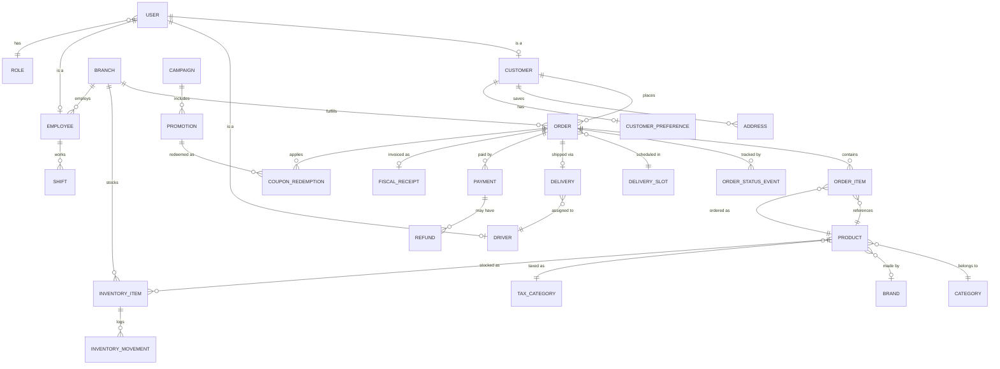

# Backend Architecture & Data Model Design

**Status:** Design only — nothing in this document is implemented.
**Scope:** Sprint 2 — Backend Architecture & Data Model Design.
**Revision:** v2 — incorporates an independent architecture review. Re-scoped
to the **Dominican Republic** as the target market (payments, currency,
tax, address model, delivery, notifications), adds a formal decision
framework to every major stack choice, and adds Disaster Recovery, Cost
Analysis, Future Marketplace Readiness, Monitoring & Observability, and
Architecture Principles as new sections. v1's Argentina-specific
recommendations (Mercado Pago, ARS) have been fully replaced, not
appended alongside — see the note at the end of §13 for why they don't
coexist.
**Relationship to other docs:** This is the technical design implemented
across `docs/ROADMAP.md` Sprints 3 through 6 (§19's Phase 0–6 below) and
the data foundation for every module in `docs/DASHBOARD_SPEC.md`. It
should be read alongside `docs/ARCHITECTURE.md` (current front-end
architecture) and `docs/DECISIONS.md` (why the app is mock-only today).
**Note on scope of this revision:** `PRODUCT_VISION.md`,
`docs/DASHBOARD_SPEC.md`, and the current mock data (`data/*.ts`) still
describe an Argentine supermarket ("Supermercados Morel," `es-AR`, ARS,
Tucumán addresses). This document was explicitly re-scoped to the
Dominican Republic per direct instruction; it does **not** update those
other files. That mismatch is real and should be reconciled — either by
updating the product docs to DR, or by treating this backend design as
market-agnostic in its *patterns* (RBAC, migration phasing, tRPC
boundaries) while swapping only the market-specific pieces (§1 payments/
notifications, §3 tax/address entities, §13) per actual target market —
before implementation begins. Flagged here, not resolved here.

This document proposes a backend architecture that can absorb the app's
current mock data model **without changing its shape at the API-consumer
level** — every current `data/*.ts` type and `services/orders.ts` function
signature was designed in Sprint 1 specifically so this migration wouldn't
require rewriting components. That constraint shaped every recommendation
below, alongside the market-fit and long-term-maintainability constraints
added in this revision.

---

## 1. Recommended Technology Stack

Every decision below that materially shapes the system now includes the
full analysis framework: the problem it solves, the options weighed, its
advantages and disadvantages, security and scalability implications,
operational cost, vendor lock-in, migration difficulty, long-term
maintenance burden, the recommendation itself, and — critically — what
happens if this turns out to be the wrong call. Minor, low-risk choices
(Zod for validation, for instance) are listed in the summary table without
the full treatment; nothing that would be expensive to reverse is.

### Summary Table

| Layer | Recommendation | One-line why |
|---|---|---|
| API layer | **tRPC** + Next.js Route Handlers | End-to-end type safety, zero codegen, extends the `services/` seam Sprint 1 already built. |
| Database | **PostgreSQL** | Orders/inventory/payments need real transactions; relational integrity matches the domain. |
| DB hosting | **Neon** | Serverless-native pooling, branch-per-PR, region selectable near the Caribbean. |
| ORM | **Prisma** | TypeScript-first, strong migrations, first-class Neon support. |
| Auth | **Auth.js (NextAuth v5)** | Self-hosted, no per-user vendor cost, full control of the RBAC model in §7. |
| Background jobs | **Inngest** | Vercel functions can't run long timers; Inngest gives durable retryable jobs without owned infra. |
| Caching / rate limiting | **Upstash Redis** | Serverless-native (HTTP), no persistent-connection problem. |
| File storage | **Vercel Blob** → **Cloudflare R2** at scale | Zero setup to start; R2's no-egress-fee model wins once image volume grows. |
| Email | **Resend** | Best DX for transactional email from Next.js. |
| SMS / WhatsApp | **Twilio (WhatsApp Business API + SMS)** | WhatsApp is the dominant consumer channel in the DR — see §12. |
| Payments | **Azul** (primary) + **CardNet** (secondary) + **Cash on Delivery** | The two dominant DR card-payment gateways, plus COD, which remains a meaningful share of DR e-commerce/delivery volume — see §13. |
| Monitoring | **Sentry** + **Vercel Analytics/Logs** | Low-effort, integrates directly with the existing deployment. |
| Validation | **Zod** | Natural pairing with tRPC/Prisma; used at every API boundary (§16). |

### 1.1 Decision: API Layer — tRPC vs. REST vs. GraphQL

- **Problem being solved:** The frontend needs a typed, low-friction way to
  call server logic without maintaining a separate API contract by hand.
- **Options considered:** (a) tRPC, (b) hand-written REST via Route
  Handlers, (c) GraphQL (Apollo/Pothos).
- **Advantages:** tRPC — types flow end-to-end with zero codegen, fastest
  to build with a single TypeScript codebase, matches the `services/`
  boundary already in place. REST — universally understood, easiest for
  external/third-party consumers. GraphQL — flexible querying, good if
  many different clients need different data shapes.
- **Disadvantages:** tRPC — not meaningfully consumable by non-TypeScript
  clients (a future native mobile app in Swift/Kotlin, or a third-party
  integration, can't call it directly without a REST/GraphQL layer in
  front of it). REST — more boilerplate, manual type-syncing between
  client and server without extra tooling. GraphQL — real complexity cost
  (schema stitching, N+1 query risk, resolver-level auth) that this app's
  current single-client shape doesn't justify.
- **Security implications:** Equivalent across all three — authorization
  is enforced in the resolver/procedure/handler layer regardless of
  transport (§7); the choice of API shape doesn't change *where* auth
  checks live.
- **Scalability:** Equivalent — all three run on the same Vercel
  function infrastructure; none has an inherent throughput advantage at
  this scale.
- **Operational cost:** $0 marginal — no additional service, just a
  library choice.
- **Vendor lock-in:** Low. tRPC is a thin layer over plain
  functions/Zod; migrating off it later means writing a REST/GraphQL
  shim around the same business logic, not rewriting the logic itself.
- **Migration difficulty (later, if needed):** Low-to-medium. Because
  business logic lives in `server/trpc/routers/*` as plain functions
  (§9), exposing the same logic over REST later is additive (new Route
  Handlers calling the same functions), not a rewrite.
- **Long-term maintenance:** Low — one less hand-maintained contract
  (no OpenAPI spec, no GraphQL schema) to keep in sync with the code.
- **Recommendation:** **tRPC**, with REST reserved for webhooks (§8) and
  added later, additively, if/when a non-TypeScript client needs one.
- **If this is wrong:** The cost of being wrong is bounded — because
  routers are plain typed functions, wrapping them in REST endpoints
  later is a few days of work, not a rewrite. This is a low-regret
  decision.

### 1.2 Decision: Database — PostgreSQL vs. Alternatives

- **Problem being solved:** Orders, inventory, and payments require
  transactional integrity (an order's items, total, and status must never
  be left in a half-written state) and real relationships (an order
  belongs to one customer, has many items, each referencing a product).
- **Options considered:** (a) PostgreSQL, (b) MySQL, (c) a document store
  (MongoDB/Firestore), (d) a serverless-native store (PlanetScale/
  DynamoDB).
- **Advantages:** Postgres — mature transactions, rich constraint/type
  system (enums, `Decimal` for money, `Json` for the AI-insight payload in
  §14), and a direct path to `pgvector` for future AI work without adding
  a new service. MySQL — comparably mature, slightly more ubiquitous
  managed-hosting choice. Document stores — flexible schema, easy
  horizontal scaling for very high write volume.
- **Disadvantages:** Postgres/MySQL — a schema migration is required for
  structural changes (mitigated by Prisma's migration tooling, §17).
  Document stores — no real relational integrity or transactions across
  documents by default, which actively fights this domain (an order's
  items and its status history are inherently relational); adopting one
  here would mean re-implementing relational guarantees in application
  code.
- **Security implications:** Equivalent baseline (encryption at rest,
  network isolation) across managed providers; Postgres's mature
  row-level permission model is a modest advantage for the branch-scoped
  access patterns in §7.
- **Scalability:** Postgres scales comfortably to well beyond this
  business's near-term volume with read replicas (§15, §17); it is not
  the limiting factor at any scale this document plans for, including the
  marketplace-scale reframing in §22.
- **Operational cost:** Comparable across Postgres/MySQL managed
  providers; document stores can be cheaper at very high write volume but
  that volume isn't in scope here (see §20).
- **Vendor lock-in:** Low if the managed *provider* is swapped (Postgres
  is Postgres) — meaningfully higher if the *database model* is swapped
  (relational → document), which would touch the entire schema and ORM
  layer.
- **Migration difficulty:** Low to move providers (dump/restore, or Neon
  → RDS/Cloud SQL). High to move database models later — this is the
  actual lock-in risk, not the vendor.
- **Long-term maintenance:** Low — Postgres is the most broadly
  understood database choice available; hiring, tooling, and community
  support are not constraints.
- **Recommendation:** **PostgreSQL.**
- **If this is wrong:** Very low realistic probability — the failure mode
  would be a future write-volume profile Postgres genuinely can't serve
  even with read replicas and partitioning, which is not this business's
  trajectory. If it happened, the mitigation is read/write splitting and
  aggressive caching (§15) long before a database-model change would be
  warranted.

### 1.3 Decision: Database Hosting — Neon vs. Vercel Postgres vs. Supabase

- **Problem being solved:** Running Postgres reliably without operating
  physical/virtual database servers, in a way compatible with Vercel's
  serverless function model (which opens many short-lived connections).
- **Options considered:** (a) Neon, (b) Vercel Postgres (Neon under the
  hood, Vercel-branded), (c) Supabase, (d) self-managed (RDS/Cloud SQL).
- **Advantages:** Neon — serverless-native pooling (essential, see §15),
  database branching per pull request (a real preview-environment win),
  generous free tier, and it's the same technology Vercel's own offering
  is built on, so there's no real trade-off in choosing Neon directly vs.
  Vercel's rebrand of it. Supabase — bundles auth, storage, and realtime,
  which could reduce the number of vendors in §1's table if adopted
  wholesale. Self-managed — maximum control, no vendor abstraction.
- **Disadvantages:** Neon — one more vendor relationship to manage (though
  see below). Supabase — adopting its bundled auth/storage/realtime would
  mean *not* using Auth.js/Vercel Blob/a dedicated realtime choice,
  coupling more of the stack to one vendor than this design otherwise
  does. Self-managed — real operational burden (patching, backups,
  connection pooling) this team should not take on at current scale.
- **Security implications:** Managed providers (Neon/Vercel
  Postgres/Supabase) all offer encryption at rest/in transit and
  provider-managed patching — meaningfully lower operational security
  burden than self-managed. No material difference between the three
  managed options.
- **Scalability:** Neon and Supabase both offer read replicas and
  autoscaling compute; comparable at the scale this document plans for.
- **Operational cost:** See §20 — Neon's free tier covers Development,
  low cost through Small Production.
- **Vendor lock-in:** Low — standard Postgres wire protocol; a
  `pg_dump`/restore moves the database to any Postgres-compatible host.
- **Migration difficulty:** Low, specifically because the underlying
  database is unmodified Postgres.
- **Long-term maintenance:** Low — this is the "managed database" trade
  that removes an entire category of operational work.
- **Recommendation:** **Neon**, chosen over the Vercel-branded rebrand
  specifically to keep the option of hosting frontend and database with
  different providers open (avoids coupling a database migration to a
  hosting migration, or vice versa) — a deliberate anti-lock-in choice,
  even though Vercel Postgres would work identically today.
- **If this is wrong:** Low regret — standard Postgres means switching
  managed providers is a `pg_dump`/restore plus a `DATABASE_URL` change,
  not a schema rewrite.

### 1.4 Decision: ORM — Prisma vs. Alternatives

- **Problem being solved:** Type-safe database access from TypeScript,
  with a maintainable migration workflow.
- **Options considered:** (a) Prisma, (b) Drizzle, (c) raw SQL with a
  lightweight query builder (Kysely).
- **Advantages:** Prisma — most mature migration tooling of the three,
  first-class Neon integration, largest ecosystem/community, and the
  schema-as-source-of-truth model matches how `data/*.ts` already
  documents shapes today. Drizzle — closer to raw SQL, arguably better
  cold-start performance in serverless functions, growing fast. Kysely —
  maximum control, zero abstraction magic.
- **Disadvantages:** Prisma — historically heavier cold-start overhead in
  serverless functions than the alternatives (materially mitigated by
  Prisma Accelerate/connection pooling, which this design already
  requires per §15). Drizzle — smaller ecosystem, less mature migration
  tooling as of this writing. Kysely — no migration tooling at all;
  the team would own that entirely by hand.
- **Security implications:** Equivalent — all three parameterize queries
  correctly by default, preventing SQL injection when used as intended.
- **Scalability:** Equivalent at this application's query complexity;
  differences matter more at very high request volume than this
  business's near/medium-term trajectory.
- **Operational cost:** $0 marginal (open source); Prisma Accelerate (an
  optional managed connection-pooling/caching add-on) has its own pricing
  if adopted instead of Neon's built-in pooler — not required, see §15.
- **Vendor lock-in:** Low-medium — schema and query code are Prisma-
  specific, but the underlying data is plain Postgres; a future ORM swap
  is a rewrite of the data-access layer only, not a data migration.
- **Migration difficulty:** Medium if ever needed (rewriting
  `server/trpc/routers/*`'s database calls), but confined entirely to
  `server/` per the folder boundary in §9 — never touches components.
- **Long-term maintenance:** Low — widest hiring pool of TypeScript ORM
  experience, extensive documentation.
- **Recommendation:** **Prisma.**
- **If this is wrong:** Bounded — the migration is a rewrite of
  `server/db`/router internals only, isolated by the same `services/`
  boundary that already isolates the frontend from persistence details.

### 1.5 Decision: Authentication — Auth.js vs. Clerk vs. WorkOS

- **Problem being solved:** Secure login for two distinct populations
  (customers and staff) sharing one identity system, with revocable
  sessions for staff.
- **Options considered:** (a) Auth.js (NextAuth v5, self-hosted), (b)
  Clerk (managed), (c) WorkOS (managed, enterprise-SSO-focused).
- **Advantages:** Auth.js — no per-monthly-active-user cost, full data
  ownership (session/user data lives in the same Postgres as everything
  else), complete control over the multi-role model in §7. Clerk —
  fastest to implement, polished pre-built UI components, handles MFA
  (§16) out of the box. WorkOS — best fit if enterprise SSO (SAML) becomes
  a requirement (unlikely for this consumer-facing business).
- **Disadvantages:** Auth.js — the team builds and maintains its own
  login UI, MFA flow, and session-management UX (all specified in this
  document, but not free). Clerk/WorkOS — per-MAU or per-seat pricing that
  scales with the business (real cost risk at consumer scale — a grocery
  app expects thousands of monthly active customers, which is exactly
  where per-MAU auth pricing becomes expensive), plus user/session data
  living outside this system's own database.
- **Security implications:** All three are defensible if configured
  correctly. Auth.js requires more direct diligence (this document's own
  §16 MFA/session/rotation requirements must be *built*, not toggled on);
  Clerk/WorkOS ship more security features by default but as a black box
  this team doesn't control the internals of.
- **Scalability:** Equivalent for this business's realistic user counts.
- **Operational cost:** Auth.js — $0 vendor cost, only the Postgres
  storage it already needs. Clerk — free tier then per-MAU pricing that
  becomes real money at consumer scale (see §20). WorkOS — priced for
  enterprise B2B SSO, a poor fit for a B2C grocery app's cost profile.
- **Vendor lock-in:** Auth.js — low (it's a library, not a hosted
  service; session data is this app's own Postgres rows). Clerk/WorkOS —
  high (user/session data lives in their systems; migrating off means a
  real user-data export/import project, not a config change).
- **Migration difficulty:** Auth.js → Clerk later: medium (would need a
  user-migration script). Clerk → Auth.js later: harder (exporting
  password hashes/sessions from a managed vendor is often not fully
  possible, typically forcing a password-reset-for-everyone migration).
- **Long-term maintenance:** Auth.js — moderate, ongoing (this team owns
  the auth UX). Clerk/WorkOS — low day-to-day, but carries the recurring
  cost above indefinitely.
- **Recommendation:** **Auth.js**, specifically because per-MAU vendor
  pricing is a poor fit for a consumer grocery app's cost structure at
  scale, and because keeping identity data in the same Postgres database
  as everything else avoids a second system of record.
- **If this is wrong:** Medium regret if wrong — migrating *to* a managed
  provider later is a real project (user migration, UI rebuild), not a
  config flip. This is the single highest-migration-cost decision in this
  document if reversed, which is exactly why it's being decided
  deliberately now rather than deferred.

### 1.6 Decision: Background Jobs — Inngest vs. Alternatives

- **Problem being solved:** Vercel serverless functions are stateless and
  time-limited; nothing in this app can run a persistent timer, retry
  logic, or scheduled job on the request path.
- **Options considered:** (a) Inngest, (b) Vercel Cron + hand-rolled retry
  logic, (c) a traditional queue (self-hosted BullMQ on a persistent
  worker), (d) QStash.
- **Advantages:** Inngest — durable execution with built-in retries and
  step-level observability, generous free tier, no infrastructure to
  operate. Vercel Cron — simplest possible option, already part of the
  Vercel account, zero new vendor. Self-hosted queue — maximum control, no
  vendor at all. QStash — simple, Upstash-ecosystem-consistent (already
  using Upstash Redis).
- **Disadvantages:** Inngest — one more vendor. Vercel Cron alone — no
  retry/backoff semantics or step-level durability out of the box; this
  team would hand-roll exactly what Inngest already provides. Self-hosted
  queue — requires a persistent worker process, which defeats the
  serverless-only deployment model this whole design is built around.
  QStash — thinner feature set than Inngest for multi-step workflows
  (e.g., "send notification, then wait, then check payment status").
- **Security implications:** Equivalent — job payloads should never
  contain secrets directly (fetch from environment/DB inside the job).
- **Scalability:** Inngest and QStash both scale with usage
  automatically; a self-hosted queue would need its own scaling story,
  which is exactly the operational burden this design avoids elsewhere.
- **Operational cost:** See §20 — Inngest's free tier covers Development
  and early production.
- **Vendor lock-in:** Medium — job *definitions* use Inngest's SDK;
  migrating means rewriting job functions against a new SDK, though the
  business logic each job calls (in `server/`) is unaffected.
- **Migration difficulty:** Medium, confined to `server/jobs/*` per §9.
- **Long-term maintenance:** Low — no infrastructure to patch/scale.
- **Recommendation:** **Inngest.**
- **If this is wrong:** Bounded — job *triggers* would need rewriting
  against a new provider's SDK, but the actual business logic each job
  invokes lives in ordinary `server/` functions unaffected by the swap.

### 1.7 Decision: Caching / Rate Limiting — Upstash Redis vs. Alternatives

- **Problem being solved:** Fast reads for hot, expensive-to-compute data
  (catalog listings, dashboard KPI aggregates) and per-IP rate limiting on
  public endpoints, in a way compatible with serverless functions.
- **Options considered:** (a) Upstash Redis, (b) a traditional
  self-hosted/managed Redis (ElastiCache), (c) in-memory/edge caching only
  (no Redis at all, relying on Vercel's data cache).
- **Advantages:** Upstash — HTTP-based client (no persistent TCP
  connection problem in serverless functions, the same issue pooling
  solves for Postgres), generous free tier, pay-per-request pricing that
  matches this app's usage pattern. Traditional Redis — lower per-request
  latency at very high, sustained request volume. No Redis — one less
  service, relies entirely on Vercel's built-in data cache for anything
  cacheable.
- **Disadvantages:** Upstash — HTTP overhead per call vs. a persistent
  connection (immaterial at this app's request volume). Traditional
  Redis — requires either a persistent connection pool (the exact problem
  serverless functions have with Postgres, §15) or a proxy layer to solve
  it, adding real operational complexity. No Redis — Vercel's data cache
  doesn't cover the rate-limiting use case at all, which is a real gap
  (public checkout/login endpoints need abuse protection from day one,
  §16).
- **Security implications:** Rate limiting is itself a security control
  (§16); its absence is the actual risk here, not the choice of provider.
- **Scalability:** Upstash scales automatically with usage; sufficient
  through every tier in §20.
- **Operational cost:** Free tier covers Development and Small
  Production; pay-per-request beyond that (§20).
- **Vendor lock-in:** Low — standard Redis protocol; portable to any
  Redis-compatible provider if needed.
- **Migration difficulty:** Low.
- **Long-term maintenance:** Low — fully managed.
- **Recommendation:** **Upstash Redis**, specifically because rate
  limiting on public endpoints is not optional (§16), and Upstash is the
  only option here that solves both caching and rate limiting without
  introducing a persistent-connection problem into a serverless
  deployment.
- **If this is wrong:** Very low regret — standard Redis protocol,
  trivially portable.

### 1.8 Decision: File Storage — Vercel Blob vs. Cloudflare R2

- **Problem being solved:** Storing and serving product photography,
  delivery/QC proof photos, and receipts.
- **Options considered:** (a) Vercel Blob, (b) Cloudflare R2, (c) AWS S3.
- **Advantages:** Vercel Blob — zero additional setup, integrates
  directly with the existing deployment, simplest signed-upload flow.
  R2 — no egress fees at all (S3-compatible API, meaningfully cheaper at
  real image volume, since serving product photos to every storefront
  visitor is an egress-heavy workload). S3 — the industry-standard
  baseline, broadest tooling support.
- **Disadvantages:** Vercel Blob — pricier at scale specifically because
  of egress costs on an image-heavy public storefront (see §20). R2 — one
  more vendor relationship. S3 — AWS's broader console/IAM complexity is
  more operational overhead than this team needs for "store and serve
  files."
- **Security implications:** Equivalent — all three support signed
  upload/download URLs, meaning file bytes never need to pass through a
  serverless function (§11).
- **Scalability:** Equivalent — all are CDN-backed at scale.
- **Operational cost:** See §20 — Vercel Blob is cheapest to start
  (bundled with the existing Vercel bill, no new signup), R2 becomes
  meaningfully cheaper once product photography is real and
  storefront-visible (i.e., once §17 Phase where real photos replace
  emoji placeholders actually ships).
- **Vendor lock-in:** Low — both are simple object storage behind a URL;
  migrating means re-uploading files and updating stored URLs, not a
  data-model change.
- **Migration difficulty:** Low.
- **Long-term maintenance:** Low for either.
- **Recommendation:** **Vercel Blob to start, Cloudflare R2 once product
  photography meaningfully drives egress volume** — an explicit,
  planned migration, not a "maybe later." This is called out precisely
  because it's a decision that should be revisited on a real cost
  trigger (§20), not forgotten about.
- **If this is wrong:** Very low regret — object storage migrations are
  mechanical (re-upload + URL update), not structural.

### 1.9 Decision: Payments — Azul vs. CardNet vs. Cash on Delivery (see §13 for full treatment)

Given the weight of this decision for the DR market specifically, its full
analysis lives in §13 rather than being duplicated here — this entry is a
pointer, not an omission.

### 1.10 Decision: Notifications — Twilio (WhatsApp + SMS) vs. Alternatives (see §12 for full treatment)

Similarly, given how much this decision depends on DR-specific consumer
behavior, its full analysis lives in §12.

### 1.11 Decision: Monitoring — Sentry vs. Alternatives

- **Problem being solved:** Detecting and diagnosing production errors
  and performance regressions across a serverless deployment where
  there's no persistent server to `tail -f` a log on.
- **Options considered:** (a) Sentry, (b) Vercel's built-in
  observability alone, (c) Datadog/New Relic (broader APM suites).
- **Advantages:** Sentry — purpose-built error tracking with source-map
  support for meaningful stack traces, generous free tier, integrates
  with both frontend and backend error paths in one place. Vercel-only —
  zero additional vendor, already included. Datadog/New Relic — the most
  comprehensive observability suites, useful once infrastructure spans
  more than "a Next.js app and a Postgres database."
- **Disadvantages:** Sentry — one more vendor (though a very
  low-operational-overhead one — see §18 monitoring section for why it's
  still worth it). Vercel-only — no structured error grouping/alerting
  comparable to a dedicated error tracker; production issues would be
  discovered by users reporting them rather than by an alert. Datadog/New
  Relic — real cost and complexity that this application's current
  infrastructure footprint doesn't yet justify.
- **Security implications:** Sentry can capture request data including
  PII if not configured carefully — scrubbing rules are required (§16,
  §18.6), not optional.
- **Scalability:** Not a scaling concern at this application's error/event
  volume.
- **Operational cost:** Free tier covers Development through Small
  Production (§20).
- **Vendor lock-in:** Low — error tracking is not coupled to business
  logic; swapping providers is a config change plus re-wiring the SDK
  initialization.
- **Migration difficulty:** Low.
- **Long-term maintenance:** Low.
- **Recommendation:** **Sentry**, with Datadog/New Relic explicitly
  deferred until infrastructure complexity (multiple services, not just
  Next.js + Postgres) actually justifies a full APM suite.
- **If this is wrong:** Very low regret.

---

## 2. Database Architecture

- **Single PostgreSQL database**, not sharded, not one-database-per-branch.
  Morel is one organization with multiple physical store locations — this
  is multi-**branch**, not multi-**tenant** (see §22 for how this
  distinction is *revisited*, not abandoned, if a future marketplace
  model is pursued). Modeling branches as rows (`Branch.id` foreign-keyed
  from `Order`, `InventoryItem`, `Employee`, etc.) is simpler to operate
  and query across (the Executive dashboard needs cross-branch rollups)
  than separate databases would be.
- **Logical domain grouping within one schema** (not literal Postgres
  schemas — one `public` schema keeps Prisma simple at this scale):
  Identity, Catalog, Inventory, Customers, Orders/Delivery, Fiscal/
  Payments, Marketing, Employees, Notifications, AI Insights. See the full
  entity list in §3.
- **Read replicas** (Neon supports this) once dashboard read load
  (Executive, Finance, aggregate KPI queries) starts contending with the
  transactional order-writing path — not needed on day one.
- **Point-in-time recovery** via the managed provider from the start —
  see §17 for the full disaster-recovery treatment; this is a checkbox at
  signup, not a project.
- **Audit-heavy tables partitioned by date** once they grow
  (`OrderStatusEvent`, `InventoryMovement`, `NotificationLog`) — deferred
  until volume justifies it (see §15).
- **Region:** Neon's US East (or equivalent AWS `us-east-1`-adjacent)
  region is the right default for the Dominican Republic — closer, lower
  latency to the Caribbean than US West, and no DR-specific data
  residency law requires local hosting as of this writing (verify current
  regulation before launch; this is a compliance detail worth a direct
  legal check, not an assumption to build on indefinitely).

---

## 3. Complete Entity List

Grouped by domain, with a one-line purpose for each. Every entity here
either already exists as a mock type in `data/*.ts`/`services/orders.ts`
(marked **[existing]**) or is new, required to support a planned
`docs/DASHBOARD_SPEC.md` module or a Dominican Republic operational/
compliance requirement (marked accordingly).

**Identity & Access**
- `User` — base identity for every human in the system (customer, driver, staff, admin), discriminated by role.
- `Role` — the RBAC roles defined in §7.
- `Session` / `Account` / `VerificationToken` — standard Auth.js/Prisma-adapter tables.

**Organization**
- `Branch` — a physical store location. **[existing, currently a free string on `AdminOrder.branch`]**

**Catalog** *(→ Product catalog, powers `/tienda`)*
- `Category` — **[existing: `data/catalog.ts` `Category`]**
- `Product` — **[existing: `data/catalog.ts` `Product`]**, gains a DR tax classification (see below).
- `Brand` — new; currently `Product.brand` is a free string, worth normalizing once brand-level reporting (Marketing, Finance) matters.

**Fiscal (DR-specific)** *(→ compliance, Finance dashboard)*
- `TaxCategory` — new; per-product ITBIS treatment (standard rate, reduced rate, or exempt) — **not hardcoded**, because a real Dominican supermarket sells a mix of ITBIS-exempt basic foodstuffs and standard-rated processed goods on the same order, and that mix must be computed per line item, not assumed uniform. See §3.1.
- `FiscalReceipt` — new; DGII-compliant receipt record (NCF — Número de Comprobante Fiscal — sequence and type) issued per order. See §3.1.

**Inventory** *(→ Inventory dashboard)*
- `InventoryItem` — stock level of one `Product` at one `Branch`. New — today's `Product.substitutable` boolean is the only stock-adjacent signal that exists.
- `InventoryMovement` — audit log of stock changes (received, sold, adjusted, expired). New.

**Customers** *(→ Customers dashboard)*
- `Customer` — profile, extends `User` (one-to-one). New — today every order hardcodes one demo customer name.
- `Address` — saved delivery addresses per customer, **restructured for the Dominican Republic** (see §3.2) — new, and deliberately not modeled the way `docs/BACKEND_ARCHITECTURE.md` v1 modeled it for Argentina.
- `CustomerPreference` — default substitution behavior, notification channel preferences (including WhatsApp opt-in, §12). New.

**Orders & Delivery**
- `Order` — **[existing: `services/orders.ts` `StoredOrder`]**, gains a link to `FiscalReceipt`.
- `OrderItem` — **[existing: `lib/cart-store.ts` `CartLine` / `data/orders.ts` `MockOrderItem`]**, including the per-item `neverSubstitute` flag — this is a named product differentiator (see `PRODUCT_VISION.md`) and must not be lost in the real schema.
- `OrderStatusEvent` — new; replaces `hooks/use-order-progress.ts`'s wall-clock simulation with a real, appended audit trail of status transitions (see §19).
- `DeliverySlot` — **[existing: `data/delivery.ts` `DeliverySlot`]**.
- `Delivery` — new; the assignment of a `Driver` + `Order` + `DeliverySlot`, plus live location if/when real GPS tracking replaces the illustrated map. Given the Dominican Republic's motorcycle-dominant last-mile delivery norm, this entity should carry a `vehicleType` distinct from the driver's own registered vehicle where relevant (dispatch flexibility).
- `Driver` — **[existing: `data/orders.ts` `Driver`]**, extends `User` (one-to-one).

**Payments & Finance** *(→ Finance dashboard)*
- `Payment` — new; replaces the cosmetic checkout payment step (§13). Supports card (Azul/CardNet) and cash-on-delivery as distinct methods.
- `Refund` — new.

**Marketing** *(→ Marketing dashboard)*
- `Campaign` — new.
- `Promotion` — new; `Product.discountPct` already exists in the type today but is unused by any component — this is its eventual backing entity.
- `CouponRedemption` — new.

**Employees** *(→ Employees dashboard)*
- `Employee` — extends `User`, branch-assigned. New.
- `Shift` — new.

**Notifications**
- `NotificationLog` — audit of every notification sent, across channels (§12), including WhatsApp delivery/read status where the provider exposes it. New.

**AI Operations** *(→ AI Operations Center — future, not current sprint)*
- `AIInsight` — generated anomaly/prediction/recommendation records. New, deferred (§14).

### 3.1 Why Tax and Fiscal Receipts Are First-Class Entities

The Dominican Republic's ITBIS (Impuesto sobre Transferencias de Bienes
Industrializados y Servicios — DR's VAT equivalent) is not a flat rate
applied uniformly to every sale. A supermarket sells a genuine mix of
ITBIS-exempt basic foodstuffs and standard-rated processed/packaged
goods within the same order, so **tax must be computed per line item
against `Product.taxCategoryId`, never assumed constant per order**.
Separately, the DGII (Dirección General de Impuestos Internos) requires
businesses to issue receipts carrying a valid NCF sequence, and DR has
been phasing in mandatory electronic invoicing (e-CF) for tax purposes.
Both of these are modeled as their own entities rather than fields
bolted onto `Order`, because: (a) tax rates and rules change over time and
by product, independent of any given order, and (b) fiscal receipts have
their own regulatory lifecycle (sequence allocation, potential voiding/
correction) that shouldn't be conflated with an order's fulfillment
status. **Exact current ITBIS rates and NCF type codes should be
confirmed against current DGII guidance at implementation time** — this
document specifies the architecture that accommodates them, not a frozen
snapshot of tax law.

### 3.2 Why the Address Model Is Dominican-Republic-Specific

Formal postal codes exist in the DR but are not consistently used for
everyday delivery navigation the way they are in some markets — Dominican
addresses are commonly landmark/reference-point-based ("frente a," "al
lado de"), especially outside the most formalized zones of Santo Domingo.
The address model therefore treats `postalCode` as optional/informational
and treats `referencePoint` (a free-text landmark description) and
geocoded `lat`/`lng` coordinates as load-bearing fields a delivery driver
actually navigates by — not an afterthought. Administrative structure
(32 provinces + the Distrito Nacional, each with municipios/sectores) is
modeled explicitly rather than as a single free-text "city" field, both
because it's how Dominican customers naturally describe where they live
and because branch/delivery-zone coverage planning (§22) needs it at that
granularity.

---

## 4. Entity Relationships

Key relationships, in prose (see §5 for the diagram):

- A **`Branch`** has many `Order`s, `InventoryItem`s, `Employee`s, and is
  the origin point for `Delivery`.
- A **`Customer`** (→ `User`) has many `Order`s and `Address`es; each
  `Order` references exactly one `Address` (denormalized/snapshotted at
  order time, since an address can change after the order ships — the
  same reasoning `StoredOrder` already applies by storing `address` as a
  plain string rather than a live reference).
- An **`Order`** belongs to one `Customer`, one `Branch`, one
  `DeliverySlot` (snapshotted, for the same reason as address — slot
  definitions can change), has many `OrderItem`s, many
  `OrderStatusEvent`s (current status derived as "the latest event," not
  stored redundantly on `Order`), and exactly one `FiscalReceipt` once
  issued.
- An **`OrderItem`** belongs to one `Order` and references one `Product`,
  which in turn references one `TaxCategory` — this is the chain that
  makes per-line-item ITBIS computation possible (§3.1).
- A **`Delivery`** belongs to one `Order`, references one `Driver`, and
  is where live location data would live if/when real GPS tracking
  replaces the current illustrated map.
- An **`InventoryItem`** is the join of one `Product` and one `Branch`
  (composite unique key), with many `InventoryMovement`s.
- A **`Payment`** belongs to one `Order` (typically one-to-one, but
  modeled one-to-many to allow retried/partial payments, and to represent
  cash-on-delivery as its own payment method rather than a special case)
  and has many `Refund`s.
- A **`FiscalReceipt`** belongs to one `Order` and one `Payment` context —
  it exists once an order is confirmed/paid, carries its own NCF sequence
  number, and is never silently mutated after issuance (corrections are a
  new, linked receipt, matching DGII's own correction model).
- **`User`** is the root of a **role-based single-table-inheritance-style
  pattern**: `Customer`, `Driver`, and `Employee` each have a one-to-one
  relation back to `User`, rather than being three unrelated tables — this
  is what lets one person theoretically hold more than one relationship to
  the business (e.g., an employee who also shops as a customer) without
  duplicate identity records, and is what Auth.js's adapter expects.

---

## 5. ER Diagram



---

## 6. Authentication Strategy

- **Auth.js (NextAuth v5)** with the Prisma adapter, backed by the same
  Postgres database as everything else — one datastore, no extra vendor
  in the auth path (see §1.5 for the full decision analysis).
- **Two login surfaces sharing one `User` table**, discriminated by role:
  a customer-facing flow (`/cuenta/ingresar`) and a staff-facing flow
  (`/admin/ingresar`) — this directly closes the gap flagged repeatedly in
  earlier docs (`docs/PROJECT_STATUS.md`, `docs/DASHBOARD_SPEC.md`): `/admin`
  is currently fully public.
- **Customers:** Google OAuth + email magic link preferred over passwords
  — minimizes password-handling liability and matches how a grocery
  shopper actually wants to log in (low friction, infrequent). Credentials
  (email+password) as a fallback only if product research shows it's
  needed. WhatsApp-based OTP login is worth evaluating post-launch given
  how dominant WhatsApp already is in this market (§12) — not committed
  to here, flagged as a plausible fast-follow.
- **Staff (drivers, branch employees, managers, admin):** invite-only
  account creation (no public staff signup), credentials-based with
  mandatory strong passwords, because staff accounts carry sensitive
  operational/customer data access. **MFA required for `finance`,
  `ops_manager`, and `admin` roles at minimum** — see §16.3 for the full
  MFA treatment.
- **Bootstrap exception:** invite-only account creation requires an
  existing privileged user to issue the invitation, which has no answer
  for the very first `admin` account. Phase 5 (§19) MUST include a
  one-time bootstrap path — e.g., a seed script (extending the
  `prisma/seed.ts` pattern already established in Phase 1) that creates a
  single initial `admin` `User` from an environment variable during first
  deploy. This path MUST be disabled or removed once at least one `admin`
  account exists in the target environment — it is a one-time
  provisioning step, not a standing feature.
- **Session strategy:** database sessions for staff (revocability matters
  — an offboarded employee's access must be killable instantly), JWT
  sessions for customers (higher volume, lower sensitivity per session,
  scales better statelessly). Auth.js supports both strategies
  simultaneously per-provider-config.
- **Password storage** (for the credentials fallback path only): `argon2`,
  never a hand-rolled hash.

---

## 7. Authorization and Roles

RBAC, enforced **server-side on every request** — a client-side role check
is a UX nicety, never the actual gate. Proposed roles, mapped to the
`docs/DASHBOARD_SPEC.md` modules they're expected to access:

| Role | Access |
|---|---|
| `customer` | Own orders, own profile/addresses. No dashboard access. |
| `driver` | Assigned deliveries only; delivery-status update endpoints. |
| `branch_staff` | Operations dashboard, scoped to their own branch; order picking/QC status updates. |
| `branch_manager` | Operations + Inventory + Employees dashboards, scoped to their own branch. |
| `ops_manager` | Operations + Inventory dashboards, **all branches**. |
| `finance` | Finance dashboard, all branches, including `FiscalReceipt`/`TaxCategory` administration. |
| `marketing` | Marketing dashboard, all branches. |
| `hr` | Employees dashboard, all branches. |
| `executive` | Executive dashboard (read-only aggregate view across all modules). |
| `admin` | Superuser — every dashboard, user/role management, system configuration. |

**Enforcement pattern:** every tRPC procedure declares its required
role(s) in middleware (a `protectedProcedure(role)` wrapper), and branch
scoping (where applicable) is enforced by injecting the caller's
`branchId` into the query, never trusting a `branchId` passed from the
client for a scoped role. `admin`/`ops_manager`/`executive`/`finance`/
`marketing`/`hr` are unscoped by branch; everyone else is branch-scoped by
construction. This is also where **principle of least privilege** (§16.9)
is enforced structurally: a role's procedure access list is additive and
explicit — a new role starts with zero access, not "everything except."

---

## 8. API Architecture

- **Internal API: tRPC**, one router per domain, mirroring the entity
  groups in §3 (`catalogRouter`, `ordersRouter`, `inventoryRouter`,
  `customersRouter`, `deliveryRouter`, `paymentsRouter`, `fiscalRouter`,
  `marketingRouter`, `employeesRouter`, `adminRouter`). This directly
  extends the pattern Sprint 1 already established with `services/` —
  each router's implementation is what `services/orders.ts` becomes once
  it's talking to Postgres instead of `localStorage`, with the exact same
  function shapes (`getOrder`, `saveOrder`, …) wherever possible, to
  minimize component-level churn during migration (§19).
- **External API: Next.js Route Handlers** under `app/api/webhooks/*` —
  plain REST, because webhook senders (Azul, CardNet, Twilio, Resend)
  speak REST, not tRPC. Every webhook handler verifies the provider's
  signature before processing anything.
- **No public/partner API is in scope yet.** If one is needed later (a
  mobile app, a third-party integration, or a marketplace vendor
  integration per §22), it should be a versioned REST or GraphQL layer
  added on top of the same tRPC business logic, not a reason to abandon
  tRPC for the internal surface now.
- **Validation:** every tRPC input and every webhook payload is parsed
  through a Zod schema before touching business logic — no implicit
  trust of client-sent shapes, even though TypeScript already types them
  at compile time (compile-time types don't protect against a malicious
  or malformed runtime request).

---

## 9. Folder Structure

Extends, rather than replaces, the Sprint 1 foundation
(`docs/ARCHITECTURE.md` §2). New additions in **bold**:

```
app/
  api/
    **webhooks/**
      **azul/route.ts**
      **cardnet/route.ts**
      **twilio/route.ts**
    **trpc/[trpc]/route.ts**        tRPC HTTP adapter entrypoint

**server/**                        NEW — server-only code, never bundled to the client
  **trpc/**
    **routers/**
      **catalog.ts**
      **orders.ts**
      **inventory.ts**
      **customers.ts**
      **delivery.ts**
      **payments.ts**
      **fiscal.ts**                NCF/ITBIS logic — DR-specific, isolated on purpose
      **marketing.ts**
      **employees.ts**
      **admin.ts**
    **trpc.ts**                    router/procedure/context setup, role middleware
    **context.ts**                 per-request context (session, db client)
  **db/**
    **client.ts**                  Prisma client singleton
  **auth/**
    **auth.config.ts**             Auth.js configuration
  **jobs/**                        Inngest function definitions
    **order-status-progression.ts**
    **notification-dispatch.ts**
    **inventory-sync.ts**

prisma/
  **schema.prisma**
  **migrations/**
  **seed.ts**                      imports data/*.ts and inserts into Postgres — see §19

data/                              UNCHANGED — stays as the seed source (§19), not deleted
services/                          UNCHANGED signatures; implementations swap from
                                    localStorage to server/trpc/routers calls
```

The `server-only` package should be imported at the top of every file
under `server/` to make it a build error if any of this code is ever
accidentally imported into a Client Component. `fiscal.ts` is kept as its
own router (rather than folded into `orders.ts` or `payments.ts`)
specifically so DR tax/compliance logic has one clear owner in the
codebase — see §22 for why this isolation also matters for future
multi-vendor evolution.

---

## 10. Environment Variables Required

```bash
# Database
DATABASE_URL=              # pooled connection string (Prisma queries)
DIRECT_URL=                # direct connection string (Prisma migrations)

# Auth
AUTH_SECRET=
AUTH_URL=
AUTH_GOOGLE_ID=
AUTH_GOOGLE_SECRET=

# Payments (Dominican Republic)
AZUL_MERCHANT_ID=
AZUL_AUTH1=
AZUL_AUTH2=
AZUL_CERTIFICATE=          # Azul requires certificate-based auth for its API
CARDNET_MERCHANT_ID=
CARDNET_API_KEY=
PAYMENT_WEBHOOK_SECRET=

# Notifications
RESEND_API_KEY=
TWILIO_ACCOUNT_SID=
TWILIO_AUTH_TOKEN=
TWILIO_WHATSAPP_FROM=      # WhatsApp Business sender, e.g. "whatsapp:+1809XXXXXXX"
TWILIO_SMS_FROM=

# File storage
BLOB_READ_WRITE_TOKEN=     # Vercel Blob — or R2 equivalents once that migration (§1.8) happens

# Caching / rate limiting
UPSTASH_REDIS_REST_URL=
UPSTASH_REDIS_REST_TOKEN=

# Background jobs
INNGEST_EVENT_KEY=
INNGEST_SIGNING_KEY=

# Monitoring
SENTRY_DSN=

# Fiscal / DGII (Dominican Republic)
DGII_NCF_SEQUENCE_PREFIX=  # per receipt type, confirm current DGII sequence rules at implementation time
FISCAL_ENVIRONMENT=        # "sandbox" | "production" — separate NCF sequences per environment

# App
# Note: the default operating branch is discovered from the database
# (Branch.isDefault), not an env var — see docs/DECISIONS.md's "default
# branch discovery" entry.
NEXT_PUBLIC_APP_URL=       # only NEXT_PUBLIC_-prefixed var expected in this list —
                            # everything else must never reach the client bundle
NODE_ENV=
```

An `.env.example` mirroring this list (with no real values) should be
added to the repo as part of implementation — flagged in
`docs/PROJECT_STATUS.md`'s pending items as missing today. See §16.2 for
secret rotation policy governing every value above.

---

## 11. File Storage Strategy

- **Vercel Blob** as the default, migrating to **Cloudflare R2** once
  product photography drives meaningful egress volume — see §1.8 for the
  full decision analysis.
- **What gets stored:** real product photography (replacing the current
  emoji+gradient placeholders — see `docs/DECISIONS.md` for why emoji was
  the deliberate MVP choice), delivery/quality-control proof-of-fulfillment
  photos, receipts/invoices (including generated `FiscalReceipt` PDFs, if
  DGII e-CF requirements call for a retrievable document — confirm at
  implementation time), any future employee/driver document uploads.
- **Upload pattern:** signed, direct-to-storage upload URLs generated by a
  tRPC procedure — never proxy file bytes through a serverless function.
- **No file storage is required for the current mock-data phase** — this
  section is purely forward-looking.

---

## 12. Notification Strategy

### 12.1 Decision: WhatsApp-First, Not SMS-First

- **Problem being solved:** Customers need reliable, timely order-status
  notifications across the checkout → delivery lifecycle.
- **Options considered:** (a) WhatsApp Business API as the primary
  channel with SMS as fallback, (b) SMS as primary, (c) email as primary,
  (d) push notifications as primary.
- **Advantages:** WhatsApp — by a wide margin the dominant consumer
  messaging channel in the Dominican Republic (and Latin America broadly);
  message delivery/read receipts are visible to the business, rich
  formatting and even order-status templates are supported, and it's free
  for the *recipient* (no per-message cost to the customer, unlike SMS on
  some plans). SMS — universal reach even to feature phones, no app
  required. Email — cheapest per-message, but materially lower open rates
  for time-sensitive delivery updates. Push — free and instant, but only
  reaches customers with the site open/app installed and notifications
  granted, which won't be most of this audience at launch.
- **Disadvantages:** WhatsApp — requires Meta Business verification and
  template-message pre-approval for the first message in a conversation
  window (a real onboarding step, not instant), and per-conversation
  pricing (§20) rather than flat per-message SMS pricing. SMS — real
  per-message cost with no delivery-confirmation richness, and
  increasingly treated as a secondary channel by consumers who already
  live in WhatsApp. Email — poor fit as the *primary* channel for
  "your order is 10 blocks away," though it remains correct for receipts.
  Push — not viable as a primary channel pre-launch given uncertain
  notification opt-in rates.
- **Security implications:** All channels require the same care —
  never include sensitive account-recovery information in a notification
  message; WhatsApp template approval also indirectly enforces message
  content review by Meta, a mild additional safeguard against ad hoc
  copy changes shipping unreviewed.
- **Scalability:** Twilio's WhatsApp Business API and SMS both scale
  automatically with usage; no infrastructure concern.
- **Operational cost:** See §20 — this is a real, usage-based line item
  from day one (no meaningful free tier at production volume), unlike
  most other services in §1.
- **Vendor lock-in:** Medium — Twilio wraps both WhatsApp and SMS behind
  one API, but the underlying WhatsApp Business relationship is with
  Meta; migrating providers means re-registering the WhatsApp Business
  sender, not just swapping an SDK.
- **Migration difficulty:** Medium, and specifically time-sensitive
  (WhatsApp template re-approval takes real calendar time) — worth
  registering and approving templates well before they're needed, not
  reactively.
- **Long-term maintenance:** Low once templates are approved and
  `NotificationLog` (§3) is in place for delivery-status auditing.
- **Recommendation:** **WhatsApp Business API (via Twilio) as the primary
  transactional channel, SMS as the fallback for customers without
  WhatsApp or for messages sent outside an approved template's allowed
  window, email for receipts/account matters, in-app toast for
  real-time updates while the tracking page is open.**
- **If this is wrong:** Bounded — SMS remains fully functional as a
  fallback throughout, so a WhatsApp-specific problem (template rejection,
  account review) degrades the experience rather than breaking
  notifications entirely.

### 12.2 Channel Summary

| Channel | Provider | Used for |
|---|---|---|
| WhatsApp | Twilio (WhatsApp Business API) | Primary transactional channel: order confirmed, preparing, out for delivery, delivered, arriving-soon alerts |
| SMS | Twilio | Fallback when WhatsApp is unavailable/unopted-in, and for customers without WhatsApp |
| Email | Resend | Order confirmation with detail, fiscal receipt delivery, account/security emails |
| Web push | Native browser Push API | Real-time updates while the tracking page (or the site generally) isn't the active tab |
| In-app toast | Existing `sonner` integration | Real-time updates while the tracking page *is* open — the real-backend replacement for `components/pedido/order-tracker.tsx`'s current client-timer-triggered toasts |

Every dispatched notification is written to `NotificationLog` regardless
of channel, both for customer support ("did they actually get notified?")
and as the data source for a future Marketing/Customers dashboard view of
engagement. `CustomerPreference` governs which channels a given customer
receives non-critical notifications on; critical transactional
notifications (payment failed, order canceled) are never fully
opt-out-able. Dispatch happens via an Inngest background job (§1.6)
triggered by domain events (primarily `OrderStatusEvent` inserts), never
inline in the request path that created the event.

---

## 13. Payment Integration Strategy

### 13.1 Decision: Azul + CardNet + Cash on Delivery

- **Problem being solved:** Accepting payment from Dominican consumers in
  a way that matches actual local payment behavior, with money settling
  to a DR-domiciled business account.
- **Options considered:** (a) Azul (Banco Popular Dominicano's payment
  gateway) as primary, (b) CardNet (the other major DR multi-bank card
  processor) as primary or secondary, (c) Stripe, (d) PayPal, (e) Cash on
  Delivery (COD) as a supported method alongside card.
- **Advantages:** Azul — the most widely integrated DR e-commerce gateway,
  direct settlement to a DR bank account, strong local support and
  documentation, supports the installment ("cuotas") promotions Dominican
  banks commonly run. CardNet — comparable local coverage, useful as a
  secondary processor for redundancy (if Azul has an outage, checkout
  doesn't go fully down — see §17.5) and for merchants whose acquiring
  bank relationship runs through CardNet rather than Banco Popular.
  Stripe — best-in-class developer experience and documentation *in
  markets it supports*. PayPal — recognizable to some customers,
  works internationally. COD — a real, non-trivial share of Dominican
  e-commerce and food-delivery volume, especially for customers wary of
  entering card details online or without a card at all; excluding it
  would exclude real, addressable demand.
- **Disadvantages:** Azul — DR-specific API with less English-language/
  global-community documentation than Stripe, certificate-based
  authentication adds initial integration friction (§10). CardNet —
  similar integration friction, and running two card processors
  simultaneously (vs. one) adds real code/testing surface. **Stripe does
  not currently support merchant accounts domiciled in the Dominican
  Republic** — this is the deciding factor that rules it out as primary
  or secondary here, not a stylistic preference (confirm current country
  support at implementation time, since provider coverage does change,
  but this is the documented reason for excluding it, replacing v1 of
  this document's Argentina-oriented Mercado Pago/Stripe pairing
  entirely). PayPal — lower penetration than card/WhatsApp-adjacent
  payment habits in this market; treated as optional, not core. COD —
  real operational cost (drivers must handle and reconcile cash,
  fraud/no-show risk on high-value orders, delayed revenue recognition
  vs. instant card settlement) and must be capped (e.g., a maximum
  COD order value) rather than offered unconditionally.
- **Security implications:** Hosted checkout / tokenized payment forms
  for both Azul and CardNet — this app's own servers must never see a raw
  card number (§16). COD has a *different* risk profile entirely (cash
  handling, driver accountability) rather than a payment-data risk —
  addressed operationally (signed delivery confirmation, driver cash
  reconciliation against `Payment` records), not cryptographically.
- **Scalability:** Both gateways handle this business's realistic
  transaction volume without issue; not a differentiator at this scale.
- **Operational cost:** Per-transaction fees (typically a percentage of
  transaction value plus a small fixed fee, consistent with regional
  card-processing norms) — not a fixed infrastructure line item, and
  therefore intentionally *not* included in the fixed-cost table in §20;
  it scales directly with revenue, which is the correct cost shape for a
  payment processor.
- **Vendor lock-in:** Medium for either gateway — payment integration
  code is provider-specific by nature (this is true of any card
  processor, not particular to Azul/CardNet); mitigated by keeping all
  payment-provider code behind the `paymentsRouter`/`fiscalRouter`
  boundary (§9), so a future processor swap touches one router's
  implementation, not the checkout UI or the `Order`/`Payment` schema.
- **Migration difficulty:** Medium, confined to `server/trpc/routers/
  payments.ts` and the corresponding webhook handler.
- **Long-term maintenance:** Low-medium — DR payment-gateway
  documentation and support channels are less globally standardized than
  Stripe's, worth budgeting slightly more integration/support time for
  than a Stripe-equivalent decision would need.
- **Recommendation:** **Azul as primary card processor, CardNet as a
  secondary/failover processor, Cash on Delivery as a supported method
  with a configurable maximum order value.** This directly replaces v1 of
  this document's Argentina-scoped Mercado Pago/Stripe recommendation —
  they do not coexist, because Mercado Pago has no meaningful DR presence
  and Stripe doesn't support DR merchant accounts; keeping either in this
  document would be actively misleading for this market.
- **If this is wrong:** Bounded by the router-boundary isolation above —
  a processor swap is confined to one router and its webhook handler, not
  a schema or checkout-UI rewrite. The COD-cap decision specifically
  should be revisited with real fraud/no-show data within the first
  operating quarter, not treated as permanent on day one.

### 13.2 Implementation Notes

- **Hosted checkout / tokenized fields, not raw card fields** — this
  app's own servers should never see a raw card number. This directly
  continues the caution already documented in `docs/DECISIONS.md` around
  the current cosmetic payment step: it exists specifically so no one is
  tempted to wire real card handling directly into
  `app/tienda/checkout/page.tsx`'s existing input fields when the time
  comes. Those fields get replaced by a hosted/tokenized payment
  component, not connected to a backend as-is.
- **Webhook-driven confirmation only.** An `Order`'s payment status is
  never set to "paid" by a client-reported success — only by a verified
  webhook from Azul/CardNet, written idempotently (a replayed webhook
  must not double-process). This is the real-backend replacement for the
  current mock checkout's `setTimeout`-simulated "payment succeeded."
- **Cash on Delivery** is recorded as a `Payment` with `provider: "cod"`
  and `status: PENDING` at order time, transitioning to `APPROVED` only
  once the driver confirms cash collection at delivery (tied to the
  `Delivery` entity's completion event) — never assumed successful just
  because the order was placed.
- **ITBIS is computed per line item** at checkout time using each
  product's `TaxCategory` (§3.1), not applied as a flat percentage to the
  order total — required for correctness given the exempt/standard-rate
  mix in a real grocery basket.
- **Refunds** go through the originating provider's API (Azul, CardNet,
  or a manual cash-refund process for COD orders), logged to the `Refund`
  entity, and must be restricted to `finance`/`admin` roles.

---

## 14. Future AI Integration Points

Directly extends `docs/ROADMAP.md`'s "Future AI Roadmap" and
`docs/DASHBOARD_SPEC.md`'s AI Operations Center spec — **not scheduled**,
included here only so the backend design doesn't foreclose it:

- **`pgvector` on the same Postgres database** for embeddings — avoids
  standing up a separate vector database for the first phase of AI work
  (product/catalog search, RAG over support content).
- **`AIInsight` table**, populated by scheduled Inngest jobs (not
  request-path inference) — anomaly detection over `OrderStatusEvent`/
  `InventoryMovement` data (e.g., a branch's prep time trending up),
  demand forecasts feeding Inventory reorder suggestions, and
  substitution-risk predictions feeding the "never substitute" UX with
  smarter defaults than today's static `Product.substitutable` boolean.
- **Conversational support**, grounded in real `Order`/`Customer` data via
  the same tRPC `ordersRouter` an AI agent would call rather than a
  separate data path — no shortcut that bypasses the authorization layer
  in §7.
- **Explicitly deferred until real operational data exists** — building
  any of this against mock/seed data would produce insights with no real
  signal and would need to be rebuilt, not extended, exactly as already
  happened once with `hooks/use-order-progress.ts`'s wall-clock
  simulation (`docs/DECISIONS.md`).

---

## 15. Scalability Considerations

- **Connection pooling is not optional in a serverless deployment.**
  Every Vercel function invocation can open a new database connection;
  without pooling (Neon's built-in pooler, or Prisma Accelerate), Postgres
  will exhaust its connection limit under moderate concurrent load. This
  must be configured from the first deployment, not retrofitted.
- **Read replicas** for dashboard-heavy aggregate queries (Executive,
  Finance) once they contend with transactional order writes — not needed
  at current/near-term scale.
- **Redis caching** for hot, expensive-to-compute reads: catalog listings,
  KPI aggregates on `/admin`-family dashboards, rate-limit counters.
- **Background jobs off the request path** for anything that doesn't need
  to block a user response — notification dispatch, AI insight generation,
  inventory reconciliation.
- **CDN-served product images** (Vercel/R2's built-in CDN) once real
  photography replaces the current emoji placeholders — never serve
  images through a serverless function.
- **Date-partitioning for high-growth audit tables**
  (`OrderStatusEvent`, `InventoryMovement`, `NotificationLog`) — deferred
  until row counts justify it; premature partitioning adds operational
  complexity for no benefit at launch scale.
- **Branch-based scaling was chosen deliberately from day one** (§2) —
  designing entities around `branchId` foreign keys now avoids a much more
  expensive later migration if/when Morel expands to more locations
  across the DR's provinces.
- **Delivery-zone modeling should follow real DR geography, not a
  uniform grid** — Santo Domingo/Distrito Nacional and Santiago carry the
  large majority of realistic near-term order density; `DeliverySlot`
  capacity planning (already province/municipality-aware once §3.2's
  address model lands) should reflect that concentration rather than
  assuming even demand across all 32 provinces from day one.

---

## 16. Security & Hardening

**Superseded as the living policy by `docs/SECURITY_ARCHITECTURE.md`.**
This section is retained as the original design rationale and MUST NOT
be treated as authoritative if the two ever disagree — future security
policy changes are made in `docs/SECURITY_ARCHITECTURE.md`, not here.

### 16.1 Baseline (carried forward from v1, still load-bearing)

- **`/admin` gains real authentication as the first backend milestone**,
  not an afterthought — it is currently the single highest-priority gap
  flagged across `docs/PROJECT_STATUS.md`, `docs/DASHBOARD_SPEC.md`, and
  `docs/ARCHITECTURE.md`. No other backend work should ship to production
  before this does.
- **Every authorization check happens server-side**, in tRPC middleware —
  a role hidden in a JWT claim or a route being "not linked" from the UI
  is never treated as access control.
- **Zod validation at every boundary** — tRPC inputs and webhook payloads
  alike. Compile-time TypeScript types don't protect against a malformed
  or malicious runtime request.
- **Webhook signature verification is mandatory** for every provider
  (Azul, CardNet, Twilio) — an unverified webhook is an open door to
  fabricating "payment succeeded" events.
- **Rate limiting** (Upstash Redis) on all public, unauthenticated
  endpoints — login, checkout initiation, password reset — to blunt
  credential-stuffing and abuse.
- **No secret ever reaches the client bundle** — enforced by the
  `server-only` package on every `server/` module and strict discipline
  around the `NEXT_PUBLIC_` prefix (only `NEXT_PUBLIC_APP_URL` is expected
  to carry it — see §10).
- **PII (addresses, phone numbers) encrypted at rest**, via the database
  provider's encryption-at-rest guarantee at minimum, with column-level
  encryption considered for the most sensitive fields once volume
  justifies the added complexity.
- **Security headers** (CSP, `X-Frame-Options`, `Referrer-Policy`) —
  already flagged as entirely absent from `next.config.ts` in
  `docs/PROJECT_STATUS.md`'s pending items; should land alongside this
  backend work, not be treated as unrelated.

### 16.2 Secret Rotation

- Every credential in §10 has an owner and a rotation cadence: payment
  gateway credentials (Azul/CardNet) rotated per the provider's own
  security guidance and immediately upon any suspected exposure;
  `AUTH_SECRET` rotated on a scheduled basis (e.g., quarterly) with a
  documented session-invalidation impact; provider API keys (Twilio,
  Resend, Sentry, Upstash, Inngest) rotated at minimum annually or
  immediately on team-member offboarding if that person had access to
  them.
- Secrets live in Vercel's environment variable system to start (already
  encrypted at rest, access-controlled by Vercel team membership); a
  dedicated secrets manager (Doppler, Infisical, or equivalent) is worth
  adopting once the team grows past a size where "who has access to the
  Vercel dashboard" is a sufficient access-control story.
- **No secret is ever committed to the repository**, including in
  `.env.example` (values-empty only) or in test fixtures.

### 16.3 Multi-Factor Authentication for Administrators

- **Required** for `admin`, `finance`, and `ops_manager` roles at
  minimum — these roles have either financial-transaction visibility/
  action capability or **cross-branch** operational control, making them
  the highest-value account-takeover targets. `branch_manager` is
  deliberately excluded from this minimum list despite also handling
  PII (Employees dashboard) and Inventory access: its blast radius is
  bounded to a single branch, whereas `admin`/`finance`/`ops_manager`
  compromise exposes every branch at once. This is a risk-scoping
  distinction, not an oversight — a business with a small number of
  branches, or one where a single branch's exposure is itself
  significant, SHOULD lower this bar to include `branch_manager`.
- **TOTP (authenticator app)** as the primary MFA method — no SMS-based
  MFA, given SIM-swap risk is a well-documented weakness of SMS OTP for
  exactly the kind of financially-sensitive accounts MFA is protecting
  here.
- **Enforced at login**, not optional/self-enrolled for these roles —
  an account in one of these roles without MFA configured should be
  blocked from completing login until enrollment, not merely nudged.
- Recovery codes generated at enrollment, stored hashed, single-use.

### 16.4 Session Management

- Staff sessions (database-backed, §6) support **explicit revocation** —
  an admin can terminate another user's active sessions immediately
  (offboarding, suspected compromise), not just wait for natural
  expiry.
- **Idle timeout** for staff sessions (e.g., re-authentication required
  after a period of inactivity) given the sensitivity of what staff
  roles can see/do; customer sessions can be longer-lived given lower
  per-session sensitivity.
- Users (customers and staff alike) can view and revoke their own active
  sessions/devices — standard account-security hygiene, and directly
  useful for DR customers who commonly share devices within a household.

### 16.5 Audit Logging

- Every privileged mutation (role changes, refunds, inventory overrides,
  fiscal receipt corrections, MFA resets performed by an admin on another
  user's behalf) is logged with: acting `User`, timestamp, the specific
  action, and a before/after snapshot of what changed — attributable to a
  person, never just a role.
- Audit logs are **append-only** — no update/delete path exists for them
  in the application layer, and database-level permissions should
  reinforce that (the application's runtime DB role should not have
  `UPDATE`/`DELETE` grants on the audit table at all — see §16.9).
- Retention: audit logs retained substantially longer than operational
  data (a multi-year retention is reasonable for this category), separate
  from the general data-retention policy for `NotificationLog` or
  `InventoryMovement`.

### 16.6 Incident Response

- **Severity levels** defined in advance (e.g., Sev1: payment/data
  breach or full outage; Sev2: partial degradation/single-provider
  outage; Sev3: non-critical bug) with a named response expectation for
  each, not decided ad hoc during an actual incident.
- **A designated security/incident contact** (even if that's one person
  at this team's current size) with contact information documented
  somewhere durable, not tribal knowledge.
- **Postmortems for every Sev1/Sev2**, written and stored (a natural
  extension of the `docs/DECISIONS.md` pattern this project already
  practices) — what happened, root cause, what changes as a result. This
  is process this project already has the habit for; incident response
  is the same discipline applied to production issues instead of
  architecture choices.
- **A basic breach-notification plan** — if customer PII (addresses,
  payment metadata) is ever exposed, DR data-protection expectations and
  affected-customer notification obligations should be understood *before*
  an incident, not researched during one.

### 16.7 Dependency Management

- **Automated dependency update PRs** (Dependabot or Renovate) from the
  first backend PR onward, not retrofitted later — this project already
  has zero dependency-scanning today per `docs/PROJECT_STATUS.md`'s
  pending items, and the backend introduces a materially larger
  dependency surface (Prisma, Auth.js, payment SDKs) than the current
  frontend-only app carries.
- **A regular (e.g., monthly) review cadence** for dependency update PRs
  that don't auto-merge, so they don't silently pile up unreviewed.

### 16.8 Supply-Chain Security

- **Lockfile integrity enforced in CI** (`npm ci`, not `npm install`, in
  any automated pipeline) so builds are reproducible from a known-good
  dependency tree, not whatever the latest semver-compatible versions
  happen to be at build time.
- **Dependency provenance/vulnerability scanning** (`npm audit` at
  minimum, Socket.dev or Snyk as a stronger option) as part of the CI
  pipeline this project still needs to stand up (`docs/PROJECT_STATUS.md`
  pending items).
- **New dependencies reviewed before adoption**, especially anything with
  install/postinstall scripts or broad filesystem/network access — a
  five-minute check before `npm install` is far cheaper than a
  supply-chain incident after.

### 16.9 Principle of Least Privilege

- **Database roles are separated by function**, not one superuser
  connection string used everywhere: the application runtime connects
  with a role scoped to exactly the operations it needs (no `DROP`,
  no schema-altering permissions), while `prisma migrate deploy` runs
  under a separate, more privileged role used only in the deploy
  pipeline, never embedded in the running application.
- **Provider API keys are scoped as narrowly as each provider allows**
  (e.g., a Sentry key that can only report events, not read project
  settings; a Twilio key scoped to the specific sender/number this app
  uses) rather than defaulting to the broadest available key because
  it's the one that "just works."
- **Role-to-procedure mapping (§7) is additive, not subtractive** — new
  roles start with access to nothing and are granted specific procedures,
  never created by copying `admin` and removing a few things.

---

## 17. Disaster Recovery

### 17.1 Backups and Point-in-Time Recovery

- **Automated daily backups** via Neon's managed backup system, retained
  for a minimum of 30 days.
- **Point-in-time recovery (PITR)** via Neon's continuous WAL
  (write-ahead log) archiving — this allows restoring the database to any
  point within the retention window, not just to the last nightly
  snapshot, which matters specifically for recovering from a bad
  migration or an accidental data-destroying operation, not only total
  data loss.
- **Backups are tested, not just taken** — a periodic (e.g., quarterly)
  restore-to-a-scratch-environment drill, confirming backups are actually
  restorable, not merely present. An untested backup is not a real
  recovery plan.

### 17.2 Recovery Objectives

| Metric | Target | Rationale |
|---|---|---|
| **RPO (Recovery Point Objective)** | ≤ 5 minutes | Neon's continuous WAL archiving supports near-continuous recovery points; 5 minutes is a conservative, achievable target for how much data (e.g., in-flight orders) could realistically be lost in a worst-case database failure. |
| **RTO (Recovery Time Objective) — database failure** | ≤ 1 hour | Time to restore from PITR to a working state, assuming the managed provider's own infrastructure is healthy (i.e., this is *this team's* recovery time, not the provider's). |
| **RTO — full application outage (Vercel-side)** | ≤ 15 minutes | Primarily bounded by Vercel's own instant-rollback capability (§17.4) rather than a from-scratch redeploy. |

These are **targets to design against**, not guarantees from any vendor —
they should be revisited once real production incident data exists, per
the "if this is wrong" discipline applied throughout this document.

### 17.3 Service Outage Scenarios

| Scenario | Impact | Mitigation |
|---|---|---|
| **Neon/database outage** | Full application outage (nothing works without the DB) | Neon's own SLA/uptime; PITR restore if data-level, not just availability-level, issue; no realistic self-hosted mitigation is worth the operational cost at this scale. |
| **Vercel outage** | Full application outage | Outside this team's control; monitor Vercel's status page, communicate proactively to customers via WhatsApp/social if extended (see §18.4 alerting). |
| **Azul or CardNet outage** | Checkout with that processor fails | This is the direct reason both are integrated (§13) — checkout can fail over to the secondary processor, and Cash on Delivery remains available as a non-card fallback throughout. |
| **Twilio (WhatsApp/SMS) outage** | Customers don't receive real-time notifications | In-app toast (while the tracking page is open) and email continue functioning independently; `NotificationLog` allows a retroactive "catch-up" notification once the provider recovers. |
| **Inngest outage** | Background jobs (notification dispatch, order-status jobs) delayed, not lost | Inngest's own durability guarantees jobs execute once the outage clears; this is a delay-tolerance design, not a lost-data risk. |
| **Regional connectivity disruption (e.g., hurricane-season impact, common in the DR's June–November storm season)** | Customers/drivers experience local internet/mobile outages independent of this system's own health | Not a hosting-region concern (infrastructure isn't DR-local), but a real driver of notification-retry tolerance and customer-support expectations — retries should be patient (extended windows, not aggressive short-interval retries that just fail repeatedly against a customer's own outage), and this should be a documented seasonal operational awareness for the support team, not a surprise every June. |

### 17.4 Deployment Rollback Strategy

- **Vercel's instant rollback** to any previous deployment is the primary
  mechanism for a bad frontend/API deploy — this is close to free (a
  platform feature, not custom tooling) and should be the default first
  response to a deploy-caused incident, not a database restore.
- **Database migrations are forward-fix, not rollback, by default** —
  Prisma down-migrations are risky in practice (data written under the
  new schema may not cleanly reverse), so the default posture is: revert
  the *application* deploy via Vercel rollback (fast, safe), then ship a
  forward-fixing migration once the actual problem is understood, rather
  than attempting to reverse a migration under incident pressure.
- **True last-resort recovery** (a migration that corrupted data in a way
  forward-fixing can't repair) falls back to PITR (§17.1) — restoring to
  the point just before the bad migration ran, understood as a genuinely
  disruptive, data-loss-bounded-by-RPO action, not a routine tool.
- **CI must block a bad migration from reaching production in the first
  place** wherever possible (§17 pairs directly with the CI work already
  flagged as a pending item in `docs/PROJECT_STATUS.md`) — recovery
  strategy is a safety net, not a substitute for a migration review
  process.

---

## 18. Monitoring & Observability

### 18.1 Logging

- **Structured (JSON) logs**, not free-text — every log line carries a
  consistent shape (timestamp, severity, a request/correlation ID,
  relevant entity IDs like `orderId`) so logs are queryable, not just
  readable.
- **A correlation ID per request**, threaded through tRPC context (§9)
  and into any background job an event triggers, so a single customer's
  order-placement-through-notification flow can be traced as one thread
  across multiple function invocations — genuinely necessary in a
  serverless, event-driven architecture where a single user action
  fans out across several independent function executions.
- **Vercel's built-in log capture**, with a log drain to a longer-
  retention destination once log volume/retention needs exceed Vercel's
  own default window.

### 18.2 Metrics

- **Function-level:** invocation count, duration, error rate per
  route/procedure (available directly from Vercel's platform metrics).
- **Database-level:** query duration/error rate (Neon's own dashboard,
  supplemented by Prisma's query logging in non-production environments).
- **Business-level:** orders per minute/hour, checkout conversion rate,
  average order value, notification delivery success rate by channel —
  the metrics that answer "is the business working," not just "is the
  infrastructure working," and the direct data source for the Executive
  and Operations dashboards (`docs/DASHBOARD_SPEC.md`) once real.

### 18.3 Tracing

- **Sentry performance tracing** (bundled with the error-tracking
  investment already made in §1.11) across the tRPC-call → database-query
  path, sufficient to answer "which step of this request was slow"
  without adopting a full separate APM suite (§1.11) before it's
  justified.
- Upgrade path to OpenTelemetry-based tracing if/when infrastructure
  complexity grows beyond what Sentry's tracing comfortably covers —
  explicitly not needed at this design's current scope.

### 18.4 Alerts

- **Sentry alert rules** for error-rate spikes and new/previously-unseen
  error types, routed to the team's actual notification channel (not
  left to be discovered by checking a dashboard).
- **Uptime monitoring** (a lightweight external service — e.g., Better
  Uptime or UptimeRobot) on the public storefront and, **specifically and
  separately, on the payment webhook endpoints** — a webhook silently
  failing is a revenue-impacting incident that produces no user-visible
  symptom until orders mysteriously stop being marked paid, making it
  one of the highest-value things to monitor directly rather than
  discover downstream.
- **Alert fatigue is a real failure mode** — alert thresholds should be
  tuned deliberately (start conservative, tighten based on real
  incident/near-miss history) rather than alerting on every possible
  anomaly from day one and training the team to ignore alerts.

### 18.5 Health Checks

- A `/api/health` endpoint verifying database connectivity (and, ideally,
  a lightweight check of each critical external dependency — payment
  gateway reachability, notification provider reachability) — the target
  for uptime monitoring (§18.4) and useful for confirming a deploy landed
  in a working state, not just a deployed one.

### 18.6 Error Reporting

- **Sentry**, with explicit **PII-scrubbing rules** configured before any
  real customer data flows through the system — addresses, phone
  numbers, and payment metadata must never land in an error-tracking
  tool's stored event data by default.
- Errors tagged with role/branch context (never with raw customer PII)
  so a support/ops engineer can triage "which branch is affected" without
  needing customer-identifying detail in the tool itself.

### 18.7 How a Production Issue Would Actually Be Detected

Concretely, tying the above together: a failing payment webhook would (1)
trigger a Sentry error from the webhook handler's signature-verification
or processing failure, (2) fail the uptime monitor's health check against
that endpoint within its check interval, (3) fire an alert to the team's
notification channel from both sources within minutes, not be discovered
hours later when someone notices orders aren't being marked paid. That
concrete path — not just "we have Sentry" — is the actual test of whether
this section is sufficient, and is worth re-verifying with a deliberate
fire-drill once implemented, not assumed correct because the tools are
configured.

---

## 19. Migration Strategy

Phased, in an order chosen to keep every intermediate state shippable and
to preserve the current UI's behavior at every step — matching the same
discipline Sprint 1 and Sprint 1.5 were held to (zero functional
regression at each checkpoint):

**Phase 0 — ✅ Complete — Stand up CI before any Phase 1 PR merges.** Build, lint,
`npm ci` (lockfile-integrity), and `npm audit` MUST all run as required
checks (`docs/INFRASTRUCTURE_ARCHITECTURE.md` §7.1) before the first
Phase 1 pull request is opened, and CI-gated `prisma migrate deploy`
(§7.2, running under the scoped migration role, not the application's
runtime role) MUST be in place before Phase 1's first migration reaches
production. This is a prerequisite, not a parallel-track item — every
MUST in this document and in `docs/ENGINEERING_STANDARDS.md`/
`docs/SECURITY_ARCHITECTURE.md` that depends on CI enforcement is
otherwise unenforceable from the first commit of implementation.

**Phase 1 — ✅ Complete — Stand up the database, seed it from current mock data.**
Write `prisma/seed.ts` to import `data/catalog.ts`, `data/delivery.ts`,
`data/orders.ts`, and `data/admin.ts` directly and insert their contents
into Postgres. This guarantees the real database starts with *exactly*
the same product catalog, delivery slots, and demo data the app already
ships with — no data-entry step, no risk of drift between mock and real
data during the transition. Connection pooling (§15) is configured as
part of this phase, not retrofitted after an incident.

**Phase 2 — ✅ Complete — Stand up the tRPC layer, mirroring `services/`'s function
shapes.** `ordersRouter.getOrder(id)` and `ordersRouter.saveOrder(order)`
should have the same effective signature as today's
`services/orders.ts`'s `getOrder`/`saveOrder`, just backed by Postgres
instead of `localStorage`. Ship this alongside the existing localStorage
implementation, unused by any component yet — a pure infrastructure PR.

**Phase 3 — ✅ Complete — Swap `services/orders.ts`'s implementation.** Change what's
*inside* `getOrder`/`saveOrder` to call the tRPC router instead of reading
`localStorage`, without changing the exported function signatures. This
is the moment components stop needing to change at all — the whole point
of Sprint 1 having isolated this behind a `services/` boundary in the
first place. Resolve the two-persistence-pattern duplication flagged in
`docs/DECISIONS.md` (`lib/cart-store.ts` vs. `services/orders.ts`) *before*
this phase, not after — see §21 in the Risks table. `generateOrderId()`
must stop producing the current "MO-" + small-numeric-range format as
the caller-supplied id it passes into `saveOrder`'s `order` argument —
`ordersRouter.saveOrder` itself was implemented in Sprint 3 already
generating an opaque `Order.id` (`@default(cuid())`) with a separate
`orderNumber` field for customer/support display, per `docs/DECISIONS.md`'s
"Order tracking identifiers must not be enumerable" and "saveOrder stays
in Sprint 3" entries — this phase's remaining work is only wiring
`generateOrderId()`'s replacement/removal and the actual cutover, not the
schema or router-level fix, which is already done. This phase also MUST
add request idempotency to `saveOrder` (a required, client-supplied
idempotency key, checked before any order is created) as part of wiring
the real checkout flow, not a separate follow-up — deliberately deferred
from Sprint 3 rather than forgotten, per `docs/DECISIONS.md`'s "saveOrder
idempotency is deferred to Sprint 4" entry, since this is the first point
`saveOrder` has a real caller at all and the first point the client's
actual retry/refresh behavior is knowable rather than guessed. This
phase must also add delivery-slot capacity enforcement (checking and
atomically decrementing `DeliverySlot.spotsLeft` when an order is
placed, rejecting a slot already at zero) — deliberately deferred from
Sprint 3, not forgotten, per `docs/DECISIONS.md`'s "Delivery-slot
capacity management is deferred to Sprint 4" entry, since it only
becomes relevant once real checkout is actually selecting among
genuinely limited slots.

**Phase 4 — ✅ Complete — Replace the order-status simulation.** Swap
`hooks/use-order-progress.ts`'s wall-clock derivation for a subscription
to real `OrderStatusEvent` rows (polling to start; upgrade to a
WebSocket/Server-Sent-Events push later if polling proves too coarse).
This is explicitly a **replacement, not an extension** — see
`docs/DECISIONS.md`.

**Phase 5 — Authentication, MFA, and `/admin` gating.** Land Auth.js,
migrate the single hardcoded demo customer name into real `Customer`
records, execute the bootstrap-admin path described in §6, enforce MFA
for the roles specified in §16.3, and put `/admin` behind the role
checks in §7. This should happen **before** Phase 6, not after — real
payment data must never flow through a system with an ungated ops
dashboard sitting next to it.

**Phase 6 — Real payments and fiscal compliance.** Replace the cosmetic
checkout payment step with the Azul/CardNet/COD integration in §13,
alongside `FiscalReceipt`/`TaxCategory` (§3.1) — these two ship together,
not sequentially, since a real payment without a compliant fiscal receipt
is not a viable production state for a DR business.

**Phase 7 — Everything else** (inventory, marketing, employees, finance,
AI) builds out incrementally per `docs/DASHBOARD_SPEC.md`'s module
dependencies, each phase shippable independently.

**Standard Prisma migration discipline throughout:** `prisma migrate dev`
locally against a Neon branch or local Postgres, `prisma migrate deploy`
as a required CI step before any production deploy (running under the
scoped migration role from §16.9, not the application's own runtime
role), migration files are never hand-edited after being generated, and a
shadow database (Prisma's default dev-migration mechanism) catches drift
before it reaches a shared environment.

---

## 20. Cost Analysis

Estimates in **USD/month**, since every listed provider bills in USD —
convert to DOP at the prevailing exchange rate for local budgeting rather
than relying on a fixed rate quoted here, which would go stale.
**Payment-processing fees (Azul/CardNet) are deliberately excluded from
this table** — they scale as a percentage of transaction volume, not as a
fixed infrastructure cost, and belong in a revenue/margin model, not an
infrastructure budget.

| Service | Development | Small Production | Medium Production | Large Production |
|---|---|---|---|---|
| Vercel (hosting) | $0 (Hobby) | $20 (Pro) | $20–100 (Pro, usage-based overage) | Enterprise (custom pricing) |
| Neon (Postgres) | $0 (Free) | $19–25 | $69–200 (+ read replica) | $500+ (dedicated/Business tier) |
| Auth.js | $0 | $0 | $0 | $0 |
| Inngest (jobs) | $0 (Free) | $0–20 | $50–100 | $200+ |
| Upstash Redis | $0 (Free) | $0–10 | $20–50 | $100+ |
| File storage (Blob/R2) | $0 (Free) | $5–10 | $20–50 | $200+ (image-heavy at scale) |
| Resend (email) | $0 (Free) | $20 | $50–100 | $200+ |
| Twilio (WhatsApp + SMS) | $5–10 | $30–50 | $100–300 | $1,000+ (volume-driven) |
| Sentry | $0 (Free) | $0–26 | $80–100 | $200+ |
| Uptime monitoring | $0 (Free) | $0–10 | $10–30 | $30–50 |
| **Estimated total (infra only)** | **~$5–20/mo** | **~$150–250/mo** | **~$500–1,200/mo** | **~$3,000–8,000+/mo** |

**What stays free initially, and what doesn't:** Auth.js is free
permanently (self-hosted, no per-user cost — see §1.5's cost analysis for
why this specifically matters at consumer scale). Neon, Inngest, Upstash,
file storage, Resend, and Sentry all have genuinely usable free tiers that
comfortably cover Development and, in most cases, early Small Production —
these become paid once real usage crosses each provider's free-tier
threshold, which should be treated as an expected, planned transition, not
a surprise bill. **Twilio (WhatsApp/SMS) has no meaningful free tier and
is usage-based from day one** — budget for it from the first production
deploy, not after launch. Payment-processing fees are, by their nature,
never free and scale with revenue rather than infrastructure usage.

These figures are **order-of-magnitude estimates for planning purposes**,
built from each provider's publicly documented pricing structure at the
time of writing — actual pricing should be re-verified against each
provider's current published rates before finalizing a budget, since SaaS
pricing changes over time.

---

## 21. Risks and Recommendations

| Risk | Recommendation |
|---|---|
| `/admin` currently has zero access control, and it's tempting to keep shipping visible dashboard features before fixing that | Treat Phase 5 (auth + MFA + `/admin` gating) as a hard prerequisite for Phase 6 (payments) and any dashboard beyond Operations v0 — not a parallel-track nice-to-have. |
| Rewriting `hooks/use-order-progress.ts` in one shot risks a regression in the app's signature "wow moment" (live tracking) | **Resolved in Sprint 4 (PR 5)** — a direct one-shot replacement was used instead of the feature-flagged side-by-side rollout originally recommended here: rigorous pre-commit verification (typecheck/lint/build, plus live browser verification against a temporary throwaway preview route covering every stage transition and the failure/retry path) substituted for a staged rollout. See `docs/DECISIONS.md`'s Sprint 4 PR 5 entry. |
| Payment integration carries real compliance risk (PCI scope, plus DR fiscal/NCF compliance) if approached casually | Commit to hosted/tokenized checkout from the first line of payment code, and ship `FiscalReceipt`/ITBIS handling in the same phase as payments, not as a follow-up — see Phase 6, §19. |
| Serverless + Postgres connection exhaustion is a common, easy-to-hit failure mode | Configure pooling (Neon pooler or Prisma Accelerate) as part of Phase 1, not as a fix after an incident. |
| Scope creep — attempting to build all 8 dashboard modules' backends simultaneously | Follow the phased order above and `docs/ROADMAP.md`'s sprint structure: Orders + Catalog + Auth first, everything else after, one module at a time, matching `docs/DASHBOARD_SPEC.md`'s own stated module dependencies. |
| The current `services/` abstraction is only as valuable as the discipline to keep using it | Any future change to how orders/catalog/etc. are fetched should go through `services/`'s existing seam (or its future router equivalents), never a component reaching directly into Prisma or a fetch call — this is the entire reason Sprint 1 introduced that boundary. |
| Two independently-duplicated persistence patterns already exist today (`lib/cart-store.ts`'s Zustand persistence vs. `services/orders.ts`'s hand-rolled localStorage), flagged in `docs/DECISIONS.md` | **Resolved in Sprint 4** — not by unifying the two patterns as originally recommended, but by elimination: `services/orders.ts`'s hand-rolled localStorage disappeared entirely once it became a thin adapter over the real backend, so there was nothing left to unify. See `docs/DECISIONS.md`'s "`services/orders.ts` becomes a UI/tRPC adapter" entry. |
| `generateOrderId()`'s "MO-" + small-numeric-range format (~10,000 possible values) was trivially enumerable, and PR 6 exposed a public, unauthenticated `getOrder(id)` procedure over it — see `docs/DECISIONS.md`'s "Order tracking identifiers must not be enumerable" entry | **Resolved in Sprint 3**, not deferred to Phase 3: `saveOrder` generates an opaque `Order.id` (`@default(cuid())`) with a separate, non-secret `orderNumber` field for display — see `docs/DECISIONS.md`'s "saveOrder stays in Sprint 3" entry. Phase 3 only needs to remove/replace `generateOrderId()`'s call site, not the id scheme itself. |
| `saveOrder` has no request idempotency — a double-click or client retry against the real checkout UI could create two distinct, fully valid orders from one logical submission | **Resolved in Sprint 4 (PR 2)** — a required, client-supplied idempotency key, checked first in the transaction, with the race handled via an outer catch after a real Postgres rollback (not a caught-and-continued mid-transaction recovery — see `docs/DECISIONS.md`'s transaction-semantics entry for why that distinction matters). |
| `saveOrder` validates a `DeliverySlot` exists but never checks or decrements `spotsLeft` — no overbooking protection or concurrency handling exists for slot capacity | **Resolved in Sprint 4 (PR 2)** — an atomic conditional decrement (`updateMany` with `spotsLeft: { gt: 0 }`), ordered after the idempotency check so a retried request never double-decrements. |
| Auth.js's self-hosted model means this team owns MFA/session UX that a managed provider would ship for free (§1.5) | Budget real implementation time for §16.3/16.4 explicitly — it's a deliberate trade for lower long-term vendor cost, not a gap to discover mid-sprint. |
| DR payment-gateway (Azul/CardNet) integration has thinner global documentation/community support than a Stripe-equivalent decision would | Budget more integration and support time than a Stripe-based estimate would suggest; confirm current certificate/API requirements directly with each provider before implementation, since DR-specific gateway documentation changes are less likely to be reflected in third-party tutorials. |
| WhatsApp Business template approval (§12) is a calendar-time dependency, not an instant integration step | Register and submit templates for approval well before Phase 6/notification work is scheduled to ship, so approval lead time doesn't block the migration timeline. |
| This document's market re-scope to the DR is not yet reflected in `PRODUCT_VISION.md`, `docs/DASHBOARD_SPEC.md`, or `data/*.ts` (still Argentina-themed) | Reconcile before implementation begins — either update those docs/mock data to the DR, or explicitly confirm this backend design should stay market-agnostic in its patterns while only the market-specific sections (payments, tax, address, notifications) are DR-specific. This is flagged, not resolved, by this revision. |

---

## 22. Future Marketplace Readiness

**Philosophy: build only what V1 needs, but avoid architectural decisions
that block future evolution.** This section describes how today's design
*could* evolve toward a multi-business marketplace model (conceptually
similar to Rappi's role in the DR) **without implementing any of it now**
— it exists to sanity-check that nothing in §1–§21 quietly forecloses
this path, not as a commitment to build it.

### 22.1 What Is Already Prepared

- **`Branch` is already a first-class entity, not a hardcoded string** —
  the natural generalization from "one business's branches" to "many
  businesses' storefronts" is extending what a `Branch`-like entity
  *means*, not introducing the concept of a separate merchant from
  scratch. The multi-branch (not multi-tenant) modeling decision in §2
  was made specifically so this door stays open.
- **RBAC (§7) is role-based, not hardcoded to "one business's staff"** —
  a `merchant_owner`/`merchant_staff`-style role tier is an additive role
  set, not a rearchitecture of the authorization model.
- **`Order` → `OrderItem` → `Product` is already the right shape for
  splitting an order across sellers** — a single cart containing items
  from multiple vendors is a query/grouping concern on top of the existing
  schema (grouping `OrderItem`s by their `Product`'s owning
  business), not a schema redesign.
- **`Payment` is already modeled as one-to-many against `Order`** (§4) —
  originally to support retried/partial payments, this same shape is
  exactly what's needed to later support splitting one payment across
  multiple sellers' payouts.
- **The `services/`/tRPC-router boundary (§8, §9) already isolates
  business logic per domain** — a future `vendorsRouter` or
  `marketplaceRouter` slots in alongside the existing routers without
  disturbing them, and the `fiscal.ts` router's isolation (§9) specifically
  anticipates that tax/compliance logic will need to become
  per-vendor-aware, not just per-Morel-branch-aware, without that logic
  being tangled into `orders.ts` today.
- **Notification and payment provider integrations are already behind
  their own router/service boundaries** — extending them to route
  messages/payouts per-vendor is additive, not a rewrite of how Twilio or
  Azul are integrated.

### 22.2 What Would Need to Change

- **A genuine `Merchant`/`Vendor` entity, distinct from `Branch`**, would
  need to be introduced — `Product.branchId` (implicitly, via
  `InventoryItem`) would need to become explicitly ownable by a merchant,
  not just stocked at a Morel-operated location.
- **Split payments/payouts** — Azul/CardNet, as evaluated in §13, are not
  built for marketplace-style fund-splitting the way Stripe Connect is in
  markets where Stripe operates; a marketplace pivot would require either
  a DR-available payment-orchestration layer that supports split
  settlement, or a manual reconciliation/payout process as an interim
  step. This is a real, non-trivial gap — not a checkbox — and is exactly
  why §13 doesn't pretend today's payment choice already supports it.
  A commission/fee engine (Morel's cut per marketplace transaction) would
  be new, not adapted from anything that exists today.
- **Delivery/driver pool would need to generalize** from "Morel's own
  fleet" to a shared logistics layer serviceable across multiple vendors
  — today's `Driver`/`Delivery` entities are Morel-branch-scoped by
  implication and would need an ownership/assignment model that isn't
  tied to one business.
- **Vendor-facing tooling** (onboarding, a vendor's own operations view,
  vendor-specific reporting) is an entirely new surface, not a variant of
  the existing staff dashboards in `docs/DASHBOARD_SPEC.md`.
- **Cross-vendor discovery/search** at the storefront level (today's
  `/tienda` is a single catalog; a marketplace needs vendor-aware
  browsing, ranking, and merchandising) is new frontend and backend work,
  not a config change.

### 22.3 What Was Intentionally Deferred

Explicitly **not** designed, scoped, or begun in this document or the
current codebase: multi-vendor onboarding flows, vendor-facing dashboards,
a commission/fee engine, split-payment/payout infrastructure, a
shared/generalized driver pool, cross-vendor search and merchandising,
and a vendor rating/review system. None of these are referenced anywhere
in `data/*.ts`, `services/`, or the current schema design — this is a
deliberate absence, not an oversight, consistent with the principle in
§23 that V1 should not be over-engineered for a future that may or may
not materialize. The value of this section is narrower and more honest
than a marketplace roadmap: it confirms that pursuing this path *later*
would mean **extending** today's entities and router boundaries in the
ways described above, rather than discovering that a V1 decision (e.g., a
payment gateway with no split-payment story, or a `Branch` model that
couldn't represent an external business) had quietly made it
significantly harder.

---

## 23. Architecture Principles

These principles govern every architectural decision made under this
document, and should govern every decision made after it, including ones
that revise or replace parts of this design:

- **Security First.** Authorization is always server-side, secrets never
  reach the client, and every payment/PII-adjacent decision defaults to
  the more cautious option, even at some cost to velocity.
- **Dominican Republic First.** Every market-facing decision — payments,
  tax, address, delivery, notifications — is evaluated against how DR
  customers and merchants actually operate, not adapted from another
  market's assumptions. When in doubt, the DR-specific answer wins over
  the internationally "standard" one.
- **Documentation First.** A decision isn't finished when the code ships
  — it's finished when `docs/DECISIONS.md` (or an equivalent record)
  explains why, matching the discipline this project has already
  practiced since Sprint 1.5.
- **Simplicity over Complexity.** The simplest architecture that
  correctly solves the actual current problem is preferred over a more
  "sophisticated" one solving a hypothetical future problem — this is why
  tRPC-in-the-same-repo was chosen over a separate service (§1.1), and
  why background jobs use a managed provider instead of a self-hosted
  queue (§1.6).
- **Scalability without Overengineering.** Design for the *shape* of
  future growth (branch-scoped foreign keys from day one, §15) without
  building the infrastructure for scale this business doesn't have yet
  (no sharding, no read replicas, no premature partitioning — all
  explicitly deferred until real load justifies them).
- **Single Source of Truth.** Every value has exactly one authoritative
  home — tax rates live on `TaxCategory`, not duplicated per order; a
  `services/` function's contract is the one thing components depend on,
  never a component reaching around it into a data layer directly.
- **Server-side Authorization.** No exceptions. A role check that only
  exists in the UI is not a security control — every one of this
  document's roles (§7) is enforced in tRPC middleware, never trusted
  from a client-sent value.
- **Future Ready, Not Future Built.** Architectural choices avoid closing
  doors — the marketplace-readiness analysis in §22 exists specifically
  to verify this — without walking through those doors before there's a
  real reason to. Build what V1 needs; don't block what V2 might need.

---

## Proposed Prisma Schema (High-Level)

This is a **structural sketch**, not a final implementation — field lists
are representative of what's needed to cover the current MVP plus the
immediate next phase (auth, payments, fiscal compliance, inventory), not
every field every future dashboard will eventually want. DR-specific
additions relative to v1 of this document are marked inline.

```prisma
// prisma/schema.prisma
// High-level structure only — not a complete, ready-to-run schema.

datasource db {
  provider  = "postgresql"
  url       = env("DATABASE_URL")
  directUrl = env("DIRECT_URL")
}

generator client {
  provider = "prisma-client-js"
}

// ---------- Identity & Access ----------

enum Role {
  CUSTOMER
  DRIVER
  BRANCH_STAFF
  BRANCH_MANAGER
  OPS_MANAGER
  FINANCE
  MARKETING
  HR
  EXECUTIVE
  ADMIN
}

model User {
  id            String    @id @default(cuid())
  email         String    @unique
  phone         String?   // DR: WhatsApp-first notifications key off this field
  name          String?
  role          Role
  mfaEnabled    Boolean   @default(false)   // NEW — required true for FINANCE/OPS_MANAGER/ADMIN, see §16.3
  createdAt     DateTime  @default(now())

  customer      Customer?
  driver        Driver?
  employee      Employee?

  // Auth.js adapter relations
  accounts      Account[]
  sessions      Session[]
}

model Account { /* Auth.js standard shape */ }
model Session { /* Auth.js standard shape */ }
model VerificationToken { /* Auth.js standard shape */ }

// ---------- Organization ----------

model Branch {
  id             String          @id @default(cuid())
  name           String
  province       String          // NEW — DR administrative structure, see §3.2
  municipality   String          // NEW
  address        String

  orders         Order[]
  inventoryItems InventoryItem[]
  employees      Employee[]
}

// ---------- Catalog ----------

model Category {
  id       String    @id
  name     String
  products Product[]
}

model Brand {
  id       String    @id @default(cuid())
  name     String    @unique
  products Product[]
}

// NEW — see §3.1
model TaxCategory {
  id       String    @id @default(cuid())
  name     String    // e.g. "ITBIS estándar", "ITBIS reducido", "Exento"
  ratePct  Decimal   // confirm current DGII rate at implementation time — not hardcoded here
  products Product[]
}

model Product {
  id             String          @id @default(cuid())
  name           String
  brandId        String?
  brand          Brand?          @relation(fields: [brandId], references: [id])
  categoryId     String
  category       Category        @relation(fields: [categoryId], references: [id])
  taxCategoryId  String          // NEW — every product must declare its ITBIS treatment
  taxCategory    TaxCategory     @relation(fields: [taxCategoryId], references: [id])
  price          Decimal         // DOP — 2 decimal places (unlike the current ARS front-end
                                  // config's 0-decimal formatting; a migration-time front-end
                                  // config adjustment, not a schema concern)
  unit           String          // "kg" | "unidad" | ...
  description    String
  imageUrl       String?         // replaces today's emoji/gradient once real photography lands
  substitutable  Boolean
  discountPct    Decimal?

  orderItems     OrderItem[]
  inventoryItems InventoryItem[]
}

// ---------- Inventory ----------

model InventoryItem {
  id        String             @id @default(cuid())
  productId String
  product   Product            @relation(fields: [productId], references: [id])
  branchId  String
  branch    Branch             @relation(fields: [branchId], references: [id])
  quantity  Int
  movements InventoryMovement[]

  @@unique([productId, branchId])
}

model InventoryMovement {
  id              String        @id @default(cuid())
  inventoryItemId String
  inventoryItem   InventoryItem @relation(fields: [inventoryItemId], references: [id])
  delta           Int           // + received, - sold/expired/adjusted
  reason          String
  createdAt       DateTime      @default(now())
}

// ---------- Customers ----------

model Customer {
  id          String        @id @default(cuid())
  userId      String        @unique
  user        User          @relation(fields: [userId], references: [id])

  addresses   Address[]
  preference  CustomerPreference?
  orders      Order[]
}

// RESTRUCTURED for the Dominican Republic — see §3.2
model Address {
  id             String   @id @default(cuid())
  customerId     String
  customer       Customer @relation(fields: [customerId], references: [id])
  street         String   // calle y número
  sector         String   // barrio/sector/ensanche
  municipality   String   // municipio
  province       String   // one of the DR's 32 provinces, or "Distrito Nacional"
  referencePoint String?  // landmark-based directions — commonly load-bearing in DR delivery
  postalCode     String?  // optional/informational, not the primary delivery key
  lat            Decimal? // geocoded — for moto-delivery routing
  lng            Decimal?
  isDefault      Boolean  @default(false)
}

model CustomerPreference {
  id                     String   @id @default(cuid())
  customerId             String   @unique
  customer               Customer @relation(fields: [customerId], references: [id])
  defaultNeverSubstitute Boolean  @default(false)
  notifyWhatsapp         Boolean  @default(true)   // NEW — WhatsApp-first, see §12
  notifyEmail            Boolean  @default(true)
  notifySms              Boolean  @default(false)
}

// ---------- Orders & Delivery ----------

enum OrderStatus {
  CONFIRMADO
  PREPARANDO
  CONTROL_CALIDAD
  EN_CAMINO
  ENTREGADO
}

model DeliverySlot {
  id         String   @id @default(cuid())
  dayLabel   String
  dateLabel  String
  timeRange  String
  capacity   String   // "alta" | "media" | "baja" | "completa"
  spotsLeft  Int
  totalSpots Int
  express    Boolean  @default(false)

  orders     Order[]
}

model Order {
  id             String            @id @default(cuid())
  customerId     String
  customer       Customer          @relation(fields: [customerId], references: [id])
  branchId       String
  branch         Branch            @relation(fields: [branchId], references: [id])
  deliverySlotId String
  deliverySlot   DeliverySlot      @relation(fields: [deliverySlotId], references: [id])
  address        String            // snapshotted, not a live Address reference — see §4
  subtotal       Decimal
  itbisTotal     Decimal           // NEW — computed from line-item TaxCategory, see §13.2
  deliveryFee    Decimal
  total          Decimal
  createdAt      DateTime          @default(now())

  items             OrderItem[]
  statusEvents      OrderStatusEvent[]
  delivery          Delivery?
  payments           Payment[]
  fiscalReceipt      FiscalReceipt?
  couponRedemptions  CouponRedemption[]
}

model OrderItem {
  id               String  @id @default(cuid())
  orderId          String
  order            Order   @relation(fields: [orderId], references: [id])
  productId        String
  product          Product @relation(fields: [productId], references: [id])
  quantity         Decimal
  neverSubstitute  Boolean @default(false)
}

model OrderStatusEvent {
  id        String      @id @default(cuid())
  orderId   String
  order     Order       @relation(fields: [orderId], references: [id])
  status    OrderStatus
  createdAt DateTime    @default(now())
  // current status = the latest event per order, not a redundant field on Order
}

model Driver {
  id         String     @id @default(cuid())
  userId     String     @unique
  user       User       @relation(fields: [userId], references: [id])
  vehicle    String     // DR: predominantly motorcycle for last-mile, see §3
  plate      String
  rating     Decimal

  deliveries Delivery[]
}

model Delivery {
  id        String   @id @default(cuid())
  orderId   String   @unique
  order     Order    @relation(fields: [orderId], references: [id])
  driverId  String
  driver    Driver   @relation(fields: [driverId], references: [id])
  // live location fields reserved for when real GPS tracking replaces
  // the illustrated map — deliberately omitted from this high-level sketch
}

// ---------- Payments & Fiscal (Dominican Republic) ----------

enum PaymentProvider {
  AZUL
  CARDNET
  COD          // NEW — Cash on Delivery, see §13
}

enum PaymentStatus {
  PENDING
  APPROVED
  REJECTED
  REFUNDED
}

model Payment {
  id            String          @id @default(cuid())
  orderId       String
  order         Order           @relation(fields: [orderId], references: [id])
  provider      PaymentProvider // NEW — was a free string in v1; DR-specific enum now
  providerRef   String?         // external payment/transaction id — null until COD is confirmed
  status        PaymentStatus
  amount        Decimal
  createdAt     DateTime        @default(now())

  refunds       Refund[]
}

model Refund {
  id        String   @id @default(cuid())
  paymentId String
  payment   Payment  @relation(fields: [paymentId], references: [id])
  amount    Decimal
  reason    String
  createdAt DateTime @default(now())
}

// NEW — DGII compliance, see §3.1
model FiscalReceipt {
  id          String   @id @default(cuid())
  orderId     String   @unique
  order       Order    @relation(fields: [orderId], references: [id])
  ncfType     String   // confirm current DGII NCF type codes at implementation time
  ncfNumber   String   @unique
  itbisAmount Decimal
  subtotal    Decimal
  total       Decimal
  issuedAt    DateTime @default(now())
  voidedAt    DateTime? // corrections are a new linked receipt, not a mutation — see §4
}

// ---------- Marketing ----------

model Campaign {
  id          String       @id @default(cuid())
  name        String
  promotions  Promotion[]
}

model Promotion {
  id          String              @id @default(cuid())
  campaignId  String
  campaign    Campaign            @relation(fields: [campaignId], references: [id])
  discountPct Decimal
  redemptions CouponRedemption[]
}

model CouponRedemption {
  id          String    @id @default(cuid())
  promotionId String
  promotion   Promotion @relation(fields: [promotionId], references: [id])
  orderId     String
  order       Order     @relation(fields: [orderId], references: [id])
}

// ---------- Employees ----------

model Employee {
  id       String  @id @default(cuid())
  userId   String  @unique
  user     User    @relation(fields: [userId], references: [id])
  branchId String
  branch   Branch  @relation(fields: [branchId], references: [id])

  shifts   Shift[]
}

model Shift {
  id         String   @id @default(cuid())
  employeeId String
  employee   Employee @relation(fields: [employeeId], references: [id])
  startsAt   DateTime
  endsAt     DateTime
}

// ---------- Notifications ----------

model NotificationLog {
  id        String   @id @default(cuid())
  userId    String
  channel   String   // "whatsapp" | "sms" | "email" | "push" | "in_app" — NEW: whatsapp first-class
  subject   String
  sentAt    DateTime @default(now())
}

// ---------- Audit (NEW — see §16.5) ----------

model AuditLog {
  id         String   @id @default(cuid())
  actorId    String   // the User who performed the action — never just a role
  action     String
  before     Json?
  after      Json?
  createdAt  DateTime @default(now())
}

// ---------- AI (future, deferred — see §14) ----------

model AIInsight {
  id        String   @id @default(cuid())
  type      String   // "anomaly" | "forecast" | "recommendation"
  scope     String   // e.g. a branchId, or "global"
  payload   Json
  createdAt DateTime @default(now())
}
```
